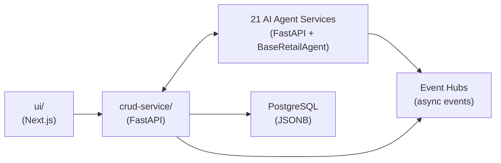

# Apps Directory

This directory contains 23 services: **1 CRUD microservice**, **21 AI agent services**, and **1 frontend UI**. Together they form the Holiday Peak Hub — an agentic retail platform for peak-season operations.

---

## Architecture Overview

Every agent service follows an identical pattern:
- Extends `BaseRetailAgent` with **SLM-first routing** (escalates to LLM for complex tasks)
- **Three-tier memory**: Hot (Redis), Warm (Cosmos DB), Cold (Blob Storage)
- Exposes `/invoke` REST endpoint + **MCP tools** for agent-to-agent communication
- Subscribes to **Event Hub topics** for async event processing
- Built with `build_service_app()` from `holiday_peak_lib.app_factory`

---

## CRM Domain

| App | Description |
|-----|-------------|
| [crm-campaign-intelligence](crm-campaign-intelligence/) | Generates campaign intelligence insights by combining CRM contact context with marketing funnel metrics. Evaluates performance, identifies drop-off stages, and recommends ROI-improving actions. Subscribes to `user-events`, `order-events`, and `payment-events`. |
| [crm-profile-aggregation](crm-profile-aggregation/) | Aggregates customer profiles across multiple data sources (contact info, account data, interaction history, engagement metrics) to build a unified customer context. Detects data gaps and computes engagement scores. Subscribes to `user-events` and `order-events`. |
| [crm-segmentation-personalization](crm-segmentation-personalization/) | Dynamically segments customers (do-not-contact / new-lead / nurture / engaged) and generates personalized channel and content recommendations based on engagement behavior and opt-in status. Subscribes to `order-events`. |
| [crm-support-assistance](crm-support-assistance/) | Generates support briefs with customer context, sentiment analysis, risk assessment, and prioritized next-best-actions for support teams. Flags escalation cases and provides contextual action recommendations. Subscribes to `order-events`. |

## Ecommerce Domain

| App | Description |
|-----|-------------|
| [ecommerce-cart-intelligence](ecommerce-cart-intelligence/) | Analyzes shopping carts and scores abandonment risk (0–1 scale). Evaluates product availability, pricing competitiveness, and inventory levels to identify conversion optimization opportunities. Subscribes to `order-events`. |
| [ecommerce-catalog-search](ecommerce-catalog-search/) | Provides ACP-compliant (Agentic Commerce Protocol) product catalog discovery with semantic search, inventory-aware results, and standardized product feed formatting. Subscribes to `product-events`. |
| [ecommerce-checkout-support](ecommerce-checkout-support/) | Validates checkout flows by verifying pricing, checking inventory availability, and detecting blockers preventing order completion. Integrates with payment authorization (authorize/capture/refund). Subscribes to `order-events` and `inventory-events`. |
| [ecommerce-order-status](ecommerce-order-status/) | Tracks orders and shipments with delivery insights including event timelines, delivery risk assessment, and exception detection. Provides proactive delay recommendations. Subscribes to `order-events`. |
| [ecommerce-product-detail-enrichment](ecommerce-product-detail-enrichment/) | Enriches product detail pages by aggregating catalog data, ACP content, reviews, inventory status, and related products. Scores content completeness and detects conversion signals. Subscribes to `product-events`. |

## Inventory Domain

| App | Description |
|-----|-------------|
| [inventory-alerts-triggers](inventory-alerts-triggers/) | Detects inventory alert conditions (low stock, reservation pressure) and recommends immediate actions such as expediting, reallocating, or notifying stakeholders. Subscribes to `inventory-events`. |
| [inventory-health-check](inventory-health-check/) | Evaluates inventory health by identifying anomalies, data gaps, and consistency issues. Recommends corrective actions and monitoring signals. Subscribes to `order-events` and `inventory-events`. |
| [inventory-jit-replenishment](inventory-jit-replenishment/) | Recommends just-in-time replenishment actions — computes reorder quantities and timing based on current availability, demand patterns, and supplier lead times. Subscribes to `inventory-events`. |
| [inventory-reservation-validation](inventory-reservation-validation/) | Validates inventory reservations against available stock, provides approval/rejection decisions, suggests alternatives when stock is low, and computes backorder details. Subscribes to `order-events`. |

## Logistics Domain

| App | Description |
|-----|-------------|
| [logistics-carrier-selection](logistics-carrier-selection/) | Recommends the optimal carrier for a shipment based on service level requirements and constraints, explaining trade-offs and risks for each option. Subscribes to `order-events`. |
| [logistics-eta-computation](logistics-eta-computation/) | Computes updated ETAs for shipments with confidence levels, highlighting potential delays and risk factors that may affect delivery. Subscribes to `order-events`. |
| [logistics-returns-support](logistics-returns-support/) | Guides returns workflows — summarizes eligibility, outlines next steps, evaluates policy constraints, and flags risks in the return process. Subscribes to `order-events`. |
| [logistics-route-issue-detection](logistics-route-issue-detection/) | Detects shipment route issues (delays, exceptions, anomalies), identifies root causes, and recommends resolution steps to keep deliveries on track. Subscribes to `order-events`. |

## Product Management Domain

| App | Description |
|-----|-------------|
| [product-management-acp-transformation](product-management-acp-transformation/) | Transforms catalog products into ACP-compliant (Agentic Commerce Protocol) payloads, ensuring all required fields are populated and flagging missing data for remediation. Subscribes to `product-events`. |
| [product-management-assortment-optimization](product-management-assortment-optimization/) | Ranks products by performance indicators (rating, price, demand) and recommends optimal assortment sets of a target size, explaining keep/drop trade-offs. Subscribes to `order-events` and `product-events`. |
| [product-management-consistency-validation](product-management-consistency-validation/) | Validates catalog product consistency — checks field completeness, detects data quality issues, and provides remediation steps for invalid items. Subscribes to `product-events`. |
| [product-management-normalization-classification](product-management-normalization-classification/) | Normalizes product names, categories, and tags into a canonical taxonomy, assigns classifications, and highlights missing attributes that need enrichment. Subscribes to `product-events`. |

## Infrastructure

| App | Description |
|-----|-------------|
| [crud-service](crud-service/) | **Pure REST microservice** (not an agent). Handles all transactional CRUD operations: authentication, users, products, categories, cart, orders, checkout sessions, payments (Stripe), reviews, plus staff-only routes for analytics, tickets, returns, and shipments. Backed by PostgreSQL with JSONB tables. Publishes domain events to Event Hubs. Exposes REST endpoints under `/api/*` and ACP endpoints under `/acp/*` including `/acp/products`, `/acp/checkout/*`, and `/acp/payments/delegate`. |
| [ui](ui/) | **Next.js 15 + TypeScript + Tailwind CSS** admin dashboard frontend. Provides product browsing, cart management, checkout, order tracking, and staff administration views. Calls the CRUD service for transactional operations and agent APIs for intelligence/search. Deployed as an Azure Static Web App. |
