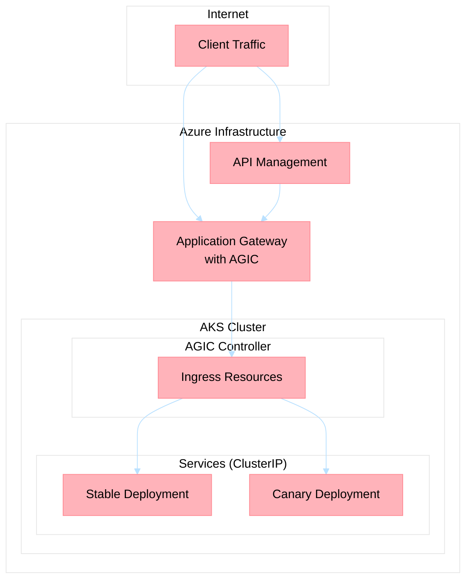
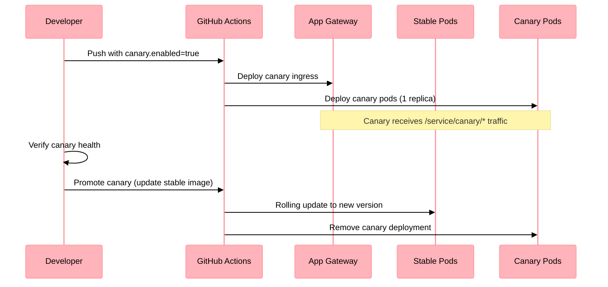

# ADR-026: Application Gateway Ingress Controller (AGIC) for Traffic Management

## Status
Superseded by ADR-027

## Date
2025-01-25

## Context

This ADR remains part of the repository's architecture history. Its original problem statement and intent to unify ingress and keep workloads behind `ClusterIP` services still matter, but its implementation guidance is no longer the target state.

The original AKS deployment architecture used individual **LoadBalancer** services for each of the 22 microservices. This approach had several critical issues:

1. **Cost Inefficiency**: Each LoadBalancer service creates a separate Azure Standard Load Balancer (~$15/month × 22 services = ~$330/month wasted)
2. **No Traffic Splitting**: ADR-009 promised canary deployments with weight-based traffic splitting, but the implementation only added a `canary: "true"` label without actual traffic management
3. **Backend Resolution Failures**: APIM backend registration relied on LoadBalancer IPs which may not be ready during deployment, causing intermittent failures
4. **No Unified Ingress**: Each service was directly exposed without centralized traffic management, security policies, or observability

### Investigation Findings

The deployment review revealed:
- `values.yaml` had `canary.enabled: true, weight: 10` but the Helm templates didn't use these values
- `deployment.yaml` only set a label without creating separate canary deployments
- `service.yaml` used `LoadBalancer` type by default
- No Ingress resources existed in the Helm chart
- ADR-009 stated *"Traffic splitting is managed at the service mesh or ingress layer"* but neither was implemented

## Decision

Implement **Azure Application Gateway Ingress Controller (AGIC)** as the unified ingress layer for all AKS services.

## Historical Status

ADR-027 supersedes the implementation strategy in this document. Specifically, the platform no longer treats AGIC or classic Application Gateway as the canonical ingress target state for APIM-published AKS services. Use this ADR as background on the original ingress consolidation effort, not as current implementation policy.

### Architecture

### Key Changes

1. **Bicep Infrastructure** (`.infra/modules/shared-infrastructure/shared-infrastructure.bicep`)
   - Added Application Gateway NSG with required security rules
   - Added Application Gateway subnet (10.0.11.0/24)
   - Created Application Gateway resource with WAF_v2 SKU for production
   - Enabled AGIC addon on AKS cluster via `ingressApplicationGatewayEnabled: true`

2. **Helm Chart Templates** (`.kubernetes/chart/`)
   - Created `ingress.yaml` with AGIC annotations for path-based routing
   - Updated `service.yaml` to default to `ClusterIP` type
   - Added canary service for progressive deployments
   - Updated `deployment.yaml` with:
     - Node selectors for targeting correct node pools (agents/crud)
     - Tolerations for node pool taints
     - Startup probes for slow-starting containers
     - Separate canary deployment when enabled

3. **Helm Values** (`.kubernetes/chart/values.yaml`)
   - Changed default service type from `LoadBalancer` to `ClusterIP`
   - Added comprehensive `ingress` configuration section
   - Restructured `canary` configuration for proper progressive deployments
   - Added `nodeSelector` and `tolerations` configuration

4. **Deployment Scripts**
   - Updated `render-helm.sh` to pass node pool targeting and ingress settings
   - Updated `sync-apim-agents.sh` with `--use-ingress` mode for App Gateway routing

5. **GitHub Actions Workflow**
   - Updated sync-apim job to use `--use-ingress` with App Gateway name

### Traffic Routing

| Traffic Type | Path | Backend |
|-------------|------|---------|
| CRUD API (health) | `/health` | crud-service ClusterIP |
| CRUD API (business) | `/api/*` | crud-service ClusterIP |
| Agent Services | `/{agent-name}/*` | agent service ClusterIP |
| Canary Traffic | `/{service-name}/canary/*` | canary deployment (when enabled) |

APIM keeps the CRUD public surface under `/api/*` and only rewrites the health probe route (`/api/health -> /health`).

### Canary Deployment Flow

## Consequences

### Positive

1. **Cost Reduction**: Single Application Gateway replaces 22 Load Balancers (~$300/month savings)
2. **True Canary Support**: Path-based canary routing with separate deployments
3. **Unified Security**: WAF protection, TLS termination at App Gateway
4. **Better Observability**: Centralized access logs and metrics
5. **Improved Reliability**: Health probes at App Gateway level, connection draining
6. **Node Pool Targeting**: Workloads now respect node pool taints (agents vs crud)

### Negative

1. **Single Point of Entry**: Application Gateway becomes critical path (mitigated by SKU redundancy)
2. **AGIC Limitations**: No native weight-based canary (requires Azure Front Door for true weighted distribution)
3. **Learning Curve**: Team needs to understand AGIC annotations and patterns

### Neutral

1. **APIM Integration**: APIM can route through App Gateway public IP or use VNet integration for internal DNS
2. **Header-based Canary**: For true A/B testing, use header routing (`x-canary: true`)

## Implementation Checklist

- [x] Add Application Gateway NSG with required rules
- [x] Add Application Gateway subnet
- [x] Create Application Gateway resource
- [x] Enable AGIC addon on AKS
- [x] Create Ingress Helm template
- [x] Update Service to ClusterIP default
- [x] Add canary service and deployment templates
- [x] Add node selectors and tolerations
- [x] Update render-helm.sh for node pool targeting
- [x] Update sync-apim-agents.sh for ingress mode
- [x] Update GitHub Actions workflow

## Alternatives Considered

1. **NGINX Ingress Controller**: More flexible canary with annotations, but requires separate installation and management
2. **Istio Service Mesh**: Full traffic management capabilities but adds significant complexity
3. **Azure Front Door**: Global load balancing with native weighted routing, but adds another layer and cost
4. **Keep LoadBalancer Services**: Status quo - rejected due to cost and lack of traffic management

AGIC was chosen as the best balance of Azure-native integration, cost efficiency, and feature set for the current requirements.

## References

- [ADR-009: AKS Deployment Architecture](adr-009-aks-deployment.md)
- [ADR-027: APIM + Application Gateway for Containers as Canonical AKS Edge](adr-027-apim-agc-edge.md)
- [AGIC Documentation](https://learn.microsoft.com/azure/application-gateway/ingress-controller-overview)
- [AGIC Annotations](https://azure.github.io/application-gateway-kubernetes-ingress/annotations/)
