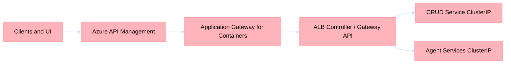

# ADR-027: APIM + Application Gateway for Containers as Canonical AKS Edge

## Status
Accepted

## Date
2026-03-17

## Context

The current ingress posture has drifted across three different models:

1. Historical **AGIC + classic Application Gateway** assumptions captured in [ADR-026](adr-026-agic-traffic-management.md)
2. AKS **Web App Routing / managed nginx** defaults still present in deployment hooks and Helm rendering
3. APIM synchronization logic that still resolves backend ingress endpoints dynamically during deployment

The live remediation work in March 2026 showed that the current public nginx `LoadBalancer` path is not a trustworthy north-south entry path for AKS. At the same time, a fully private edge redesign is not the immediate target because:

- APIM is currently public in external mode
- Application Gateway for Containers (AGC) frontends are public-only today
- Azure AI Foundry remains a public dependency for this platform

The platform still needs a single, stable ingress tier for AKS workloads while preserving:

- APIM as the public API facade
- `ClusterIP` service exposure inside AKS
- deterministic deployment and smoke validation

## Decision

Adopt **APIM -> Application Gateway for Containers -> AKS** as the canonical north-south path for AKS-hosted services.

This ADR is the platform's target-state edge strategy and governance anchor for AKS ingress.

### Target State

### Responsibility Boundary

- **APIM owns** public hostname, public path contract, auth, CORS, rate limiting, subscriptions, and coarse request policy.
- **AGC owns** AKS ingress, listener and route evaluation, backend health, and traffic delivery to Kubernetes services.
- **AKS services remain `ClusterIP`** unless an explicit exception is documented.

### Implementation Rules

1. APIM backends must target an approved **AGC hostname**, never pod IPs, service IPs, node IPs, or `*.svc.cluster.local` addresses.
2. CRUD keeps its public APIM contract under `/api/*`, with `/api/health -> /health` remaining an APIM-owned rewrite.
3. AGC becomes the only supported ingress implementation for AKS workloads after migration completes.
4. Gateway API is the preferred end state for Kubernetes route definitions, but transitional Ingress-based publication is allowed during migration.
5. Legacy nginx Web App Routing and AGIC assumptions must be removed from CI/CD and governance once cutover is complete.

### Governance Directives

1. Treat this ADR as the authoritative policy record for AKS north-south ingress decisions unless a newer ADR explicitly supersedes it.
2. APIM remains the only supported public facade for platform APIs; AKS workloads must not be exposed as direct internet-facing service endpoints.
3. `ClusterIP` is the default and required service type for APIM-published AKS workloads unless a separately accepted ADR documents an exception.

## Consequences

### Positive

1. Replaces the current broken public nginx `LoadBalancer` dependency with Azure's current AKS ingress direction.
2. Keeps the public contract stable by preserving APIM as the only supported public facade.
3. Preserves private workload exposure inside AKS by standardizing on `ClusterIP` backends.
4. Reduces deployment drift by moving APIM backend targeting from live IP discovery to hostname-based ingress resolution.

### Negative

1. Adds a second public L7 hop because AGC frontends are public-only today.
2. Requires coordinated IaC, workflow, APIM sync, and documentation changes.
3. Does not deliver a fully private edge architecture; that remains a later increment.

### Neutral

1. Existing App Gateway-first intent from [ADR-026](adr-026-agic-traffic-management.md) remains valid, but the implementation standard changes from AGIC/classic App Gateway to AGC.
2. Gateway API adoption can be phased after ingress stabilization instead of being bundled into the first cutover.

## Alternatives Considered

1. **Keep AKS Web App Routing / nginx as the production edge**
   Rejected because the current failure path already demonstrated this is the unstable part of the stack.

2. **Repair classic App Gateway / AGIC and retain it as the long-term ingress**
   Rejected because AGC is the forward direction for AKS-native ingress and better fits the desired control boundary.

3. **Move directly to a fully private APIM + private ingress architecture**
   Deferred because it is a larger networking program and does not align with the current public dependency posture.

## Supersession

This ADR supersedes the **implementation details** of [ADR-026](adr-026-agic-traffic-management.md) while preserving its core intent of unified ingress and `ClusterIP` service exposure.

## Operational Recovery

When `azd env refresh` fails to populate AGC outputs (due to ARM deployment state being `Failed`),
the CI/CD pipeline recovers AGC keys via direct Azure CLI queries. This recovery path is critical
because `AGC_SUPPORT_ENABLED` gates three downstream pipeline jobs:

- `validate-agc-readiness` — verifies GatewayClass status and AGC frontend health
- `sync-apim` — configures APIM backends to target the AGC frontend hostname
- `sync-apic` — registers APIs in Azure API Center

**Recovery dependency chain**:

1. `AGC_SUPPORT_ENABLED` is inferred from the existence of the `agc` subnet in the VNet
2. When enabled, deterministic keys (`AGC_GATEWAY_CLASS`, `AGC_FRONTEND_REFERENCE`, `AGC_CONTROLLER_DEPLOYMENT_MODE`) are set as constants
3. Infrastructure keys (`AGC_SUBNET_ID`, `AGC_CONTROLLER_IDENTITY_NAME`, `AGC_CONTROLLER_IDENTITY_CLIENT_ID`) are queried via `az network` and `az identity` commands
4. `AGC_FRONTEND_HOSTNAME` is queried via the `alb` CLI extension (`az network alb frontend list`); empty is treated as non-fatal since the ALB controller may not have reconciled yet

**Edge case**: On first deployment, `AGC_FRONTEND_HOSTNAME` is empty until the ALB controller
reconciles a `Gateway` resource. In this scenario, `validate-agc-readiness` will fail (expected),
and `sync-apim` will be skipped. A subsequent pipeline run after ALB controller reconciliation
will succeed.

## References

- [ADR-009](adr-009-aks-deployment.md)
- [ADR-026](adr-026-agic-traffic-management.md)
- [Infrastructure Governance](../../governance/infrastructure-governance.md)
- [Deployment Guide](../../../.infra/DEPLOYMENT.md)