# ADR-034: Namespace Isolation Strategy

**Status**: Proposed
**Date**: 2026-04-11
**Deciders**: Architecture Team, Ricardo Cataldi
**Tags**: infrastructure, kubernetes, aks, namespace, security, istio, flux, network-policy
**References**: [ADR-031](adr-031-mcp-internal-communication-policy.md), [ADR-033](adr-033-helm-deployment-strategy.md), [ADR-009](adr-009-aks-deployment.md), [ADR-027](adr-027-apim-agc-edge.md), [ADR-028](adr-028-memory-namespace-isolation-contract.md)

## Context

The holiday-peak-hub platform deploys 27 production services to AKS: 1 CRUD service (transactional system of record) and 26 agent services (including 4 truth-layer services). All services currently run in a single `holiday-peak` Kubernetes namespace, despite node-level isolation already being enforced via dedicated node pools (`aks-crud`, `aks-agents`, `aks-system`) with taints (ADR-009).

A single shared namespace presents the following problems:

1. **Blast radius** — A misconfigured RBAC binding, resource quota, or network policy in one workload class affects all 27 services. A runaway agent pod can consume the namespace's resource quota, starving the CRUD service (the transactional system of record).
2. **Observability noise** — Logs, metrics, and traces for 27 services share label selectors, making per-concern dashboards noisy and alert routing less precise.
3. **Security posture** — Kubernetes RBAC permissions, Secrets, ConfigMaps, and ServiceAccount tokens are namespace-scoped. A single namespace means every service's ServiceAccount can enumerate every other service's Secrets by default.
4. **Deployment independence** — With Flux CD (ADR-033), a single Kustomization reconciling all 27 services means a rendering error in one agent blocks deployment of the CRUD service and vice versa.
5. **Istio policy granularity** — Istio `AuthorizationPolicy` and `PeerAuthentication` resources are namespace-scoped. A single namespace makes it impossible to enforce distinct mTLS modes or access policies for the two workload classes without per-service policy explosion.

Architecture frameworks applied:

- **TOGAF (Architecture Building Blocks)**: Namespace boundaries are governed infrastructure building blocks whose scope affects security, deployment, and observability.
- **Domain-Driven Design (Bounded Contexts)**: CRUD (transactional) and Agent (intelligence) are fundamentally different bounded contexts with different scaling, availability, and security characteristics.
- **Azure Well-Architected Framework (Security / Operational Excellence)**: Least privilege, defense in depth, and independent deployment units.
- **microservices.io (Database per Service, Bulkhead)**: Namespace isolation is the Kubernetes-native bulkhead mechanism.

## Decision

Split the existing `holiday-peak` namespace into exactly **two namespaces**:

| Namespace | Services | Node Pool | Purpose |
|-----------|----------|-----------|---------|
| `holiday-peak-crud` | `crud-service` (1 service) | `aks-crud` | Transactional system of record: products, orders, cart, customers |
| `holiday-peak-agents` | All 26 agent services (including `truth-ingestion`, `truth-enrichment`, `truth-hitl`, `truth-export`) | `aks-agents` | Intelligence, enrichment, search, support, logistics, CRM, product management |

### Why Two Namespaces, Not More

Three or more namespaces (e.g., separating truth-layer or per-domain) were evaluated and rejected:

- **Truth services** share the same scaling characteristics, node pool, memory patterns (ADR-028), and MCP communication topology as other agents. Separating them adds cross-namespace complexity without measurable security or operational benefit.
- **Per-domain namespaces** (CRM, eCommerce, inventory, logistics, product-management) would create 6+ namespaces for 26 services, multiplying Flux Kustomizations, Istio policies, AGC routing rules, and RBAC bindings. The incremental isolation is not justified at current scale.

The two-namespace split maximizes the ratio of isolation benefit to operational cost by targeting the single most meaningful workload boundary: transactional vs. intelligence.

### Namespace Topology

```mermaid
%%{init: {'theme': 'base', 'themeVariables': { 'primaryColor': '#1a1a2e', 'primaryTextColor': '#e0e0e0', 'primaryBorderColor': '#00d4ff', 'lineColor': '#00d4ff', 'secondaryColor': '#16213e', 'tertiaryColor': '#0f3460', 'background': '#0d1117', 'mainBkg': '#1a1a2e', 'nodeBorder': '#00d4ff', 'clusterBkg': '#16213e', 'clusterBorder': '#00d4ff', 'titleColor': '#00d4ff', 'edgeLabelBackground': '#1a1a2e', 'nodeTextColor': '#e0e0e0' }}}%%
flowchart TB
    subgraph AKS["AKS Cluster"]
        direction TB

        subgraph SYS["aks-system pool"]
            direction LR
            ISTIO[Istio Control Plane]
            FLUX[Flux Controllers]
            KEDA[KEDA Operator]
        end

        subgraph CRUD_NS["namespace: holiday-peak-crud<br/>(aks-crud pool — 1 node)"]
            direction LR
            CRUD[crud-service]
        end

        subgraph AGENTS_NS["namespace: holiday-peak-agents<br/>(aks-agents pool — 5 nodes)"]
            direction LR
            CRM1[crm-profile-aggregation]
            CRM2[crm-segmentation-personalization]
            CRM3[crm-support-assistance]
            CRM4[crm-campaign-intelligence]
            ECOM1[ecommerce-cart-intelligence]
            ECOM2[ecommerce-catalog-search]
            ECOM3[ecommerce-checkout-support]
            ECOM4[ecommerce-order-status]
            ECOM5[ecommerce-product-detail-enrichment]
            INV1[inventory-alerts-triggers]
            INV2[inventory-health-check]
            INV3[inventory-jit-replenishment]
            INV4[inventory-reservation-validation]
            LOG1[logistics-carrier-selection]
            LOG2[logistics-eta-computation]
            LOG3[logistics-returns-support]
            LOG4[logistics-route-issue-detection]
            PM1[product-management-acp-transformation]
            PM2[product-management-assortment-optimization]
            PM3[product-management-consistency-validation]
            PM4[product-management-normalization-classification]
            SE[search-enrichment-agent]
            T1[truth-ingestion]
            T2[truth-enrichment]
            T3[truth-hitl]
            T4[truth-export]
        end
    end

    EXT_APIM[Azure APIM + AGC] -->|north-south| CRUD
    EXT_APIM -->|north-south| ECOM2
    EXT_APIM -->|north-south| CRM3
    CRUD -->|APIM gateway| CRM1
    ECOM1 -->|cross-namespace DNS| CRUD
    T1 -->|cross-namespace DNS| CRUD
    CRM1 -->|MCP via APIM| CRM2
```



### Communication Paths After Namespace Split

#### Agent → CRUD: Direct Cross-Namespace Kubernetes DNS (Option A — Selected)

Agent services that need transactional data from the CRUD service will use the cross-namespace Kubernetes DNS FQDN:

```
http://crud-service-crud-service.holiday-peak-crud.svc.cluster.local:8000
```

**Why Option A over Option B (routing through APIM)**:

| Criterion | Option A: Direct K8s DNS | Option B: Via APIM |
|-----------|--------------------------|---------------------|
| Latency | ~1-2 ms (in-cluster) | ~15-30 ms (APIM + AGC hop) |
| Cost | Zero additional RU/request cost | APIM request units per call |
| Reliability | No external dependency | APIM outage blocks agent→CRUD |
| mTLS | Istio sidecar-to-sidecar | Terminated at AGC, re-encrypted to APIM |
| Observability | Full Istio telemetry | Split across APIM logs + Istio |
| Blast radius | Cluster-local, no public path | Uses public APIM facade for internal traffic |
| Symmetry | Asymmetric with CRUD→Agent | Symmetric but architecturally wasteful |

**Decision**: Option A. Agent→CRUD is a hot path (product lookups, order reads, cart validation) invoked by every agent enrichment cycle. Adding 15-30 ms per call across 26 services with multiple CRUD calls each would degrade the platform's primary value proposition — low-latency intelligent retail experiences. APIM exists as the **public facade** (ADR-027); using it for intra-cluster traffic violates separation of concerns.

**Mitigation for asymmetry**: CRUD→Agent calls already go through APIM because CRUD is the entry point for external requests and agent calls are policy-gated intelligence lookups. Agent→CRUD calls are internal data-plane reads that benefit from locality. The asymmetry is intentional and architecturally sound.

#### CRUD → Agent: Via APIM (No Change)

Per ADR-027 and ADR-031, CRUD calls agent REST endpoints through APIM for enrichment/decision assist flows. This path is unchanged by the namespace split.

#### Agent → Agent: MCP via APIM (No Change)

Per ADR-031, agent-to-agent communication uses MCP tools routed through APIM. All 26 agent services are registered as MCP Servers in APIM. This path is namespace-agnostic and unchanged.

#### External Traffic: APIM → AGC → ClusterIP (Updated)

Per ADR-027, external traffic flows through APIM → AGC → AKS. AGC HTTPRoute resources will now target services in their respective namespaces. The AGC Gateway resource must reference both namespaces.

### `CRUD_SERVICE_URL` Environment Variable Migration

All 26 agent services read `CRUD_SERVICE_URL` from environment variables. The migration updates this single value:

| Before | After |
|--------|-------|
| `http://crud-service-crud-service.holiday-peak.svc.cluster.local:8000` | `http://crud-service-crud-service.holiday-peak-crud.svc.cluster.local:8000` |

This is set in Helm values per service and rendered into deployment manifests by `render-helm.sh`. The change is a values-only update — no application code changes required.

### Istio Service Mesh Configuration

#### PeerAuthentication (mTLS)

Enable `STRICT` mTLS independently per namespace to ensure all inter-namespace traffic is encrypted and identity-verified:

```yaml
# holiday-peak-crud namespace
apiVersion: security.istio.io/v1
kind: PeerAuthentication
metadata:
  name: default
  namespace: holiday-peak-crud
spec:
  mtls:
    mode: STRICT
---
# holiday-peak-agents namespace
apiVersion: security.istio.io/v1
kind: PeerAuthentication
metadata:
  name: default
  namespace: holiday-peak-agents
spec:
  mtls:
    mode: STRICT
```

#### AuthorizationPolicy

Restrict which workloads can reach the CRUD service. Only agent services from `holiday-peak-agents` and the Istio ingress gateway (for AGC traffic) are permitted:

```yaml
apiVersion: security.istio.io/v1
kind: AuthorizationPolicy
metadata:
  name: crud-service-access
  namespace: holiday-peak-crud
spec:
  selector:
    matchLabels:
      app: crud-service
  action: ALLOW
  rules:
    # Allow agent services from the agents namespace
    - from:
        - source:
            namespaces: ["holiday-peak-agents"]
      to:
        - operation:
            ports: ["8000"]
    # Allow AGC ingress gateway
    - from:
        - source:
            namespaces: ["istio-system"]
      to:
        - operation:
            ports: ["8000"]
```

Agent-to-agent communication within `holiday-peak-agents` is unrestricted (same-namespace, governed by ADR-031 MCP policy). A default-deny policy for agent services blocks external namespaces except `istio-system`:

```yaml
apiVersion: security.istio.io/v1
kind: AuthorizationPolicy
metadata:
  name: agents-default-access
  namespace: holiday-peak-agents
spec:
  action: ALLOW
  rules:
    # Allow intra-namespace (agent-to-agent)
    - from:
        - source:
            namespaces: ["holiday-peak-agents"]
    # Allow AGC ingress
    - from:
        - source:
            namespaces: ["istio-system"]
    # Allow CRUD callbacks (e.g., event confirmations)
    - from:
        - source:
            namespaces: ["holiday-peak-crud"]
```

### Kubernetes NetworkPolicies (Defense in Depth)

NetworkPolicies operate at L3/L4 as a defense-in-depth layer beneath Istio's L7 policies. If Istio sidecars fail to inject or are bypassed, these policies still enforce boundaries.

```yaml
# Deny all ingress by default in holiday-peak-crud
apiVersion: networking.k8s.io/v1
kind: NetworkPolicy
metadata:
  name: default-deny-ingress
  namespace: holiday-peak-crud
spec:
  podSelector: {}
  policyTypes:
    - Ingress
---
# Allow ingress to CRUD from agents namespace and istio-system
apiVersion: networking.k8s.io/v1
kind: NetworkPolicy
metadata:
  name: allow-agents-and-ingress
  namespace: holiday-peak-crud
spec:
  podSelector:
    matchLabels:
      app: crud-service
  policyTypes:
    - Ingress
  ingress:
    - from:
        - namespaceSelector:
            matchLabels:
              kubernetes.io/metadata.name: holiday-peak-agents
        - namespaceSelector:
            matchLabels:
              kubernetes.io/metadata.name: istio-system
      ports:
        - protocol: TCP
          port: 8000
---
# Deny all ingress by default in holiday-peak-agents
apiVersion: networking.k8s.io/v1
kind: NetworkPolicy
metadata:
  name: default-deny-ingress
  namespace: holiday-peak-agents
spec:
  podSelector: {}
  policyTypes:
    - Ingress
---
# Allow ingress to agents from same namespace, crud namespace, and istio-system
apiVersion: networking.k8s.io/v1
kind: NetworkPolicy
metadata:
  name: allow-internal-and-ingress
  namespace: holiday-peak-agents
spec:
  podSelector: {}
  policyTypes:
    - Ingress
  ingress:
    - from:
        - namespaceSelector:
            matchLabels:
              kubernetes.io/metadata.name: holiday-peak-agents
        - namespaceSelector:
            matchLabels:
              kubernetes.io/metadata.name: holiday-peak-crud
        - namespaceSelector:
            matchLabels:
              kubernetes.io/metadata.name: istio-system
      ports:
        - protocol: TCP
          port: 8000
```

### Flux CD Multi-Kustomization (ADR-033 Extension)

Split the single Flux `Kustomization` into two independent reconciliation units, one per namespace. This ensures a rendering error in one namespace does not block deployment of the other.

```yaml
# Kustomization for CRUD namespace
apiVersion: kustomize.toolkit.fluxcd.io/v1
kind: Kustomization
metadata:
  name: holiday-peak-crud
  namespace: flux-system
spec:
  interval: 5m
  path: .kubernetes/rendered/crud-service
  prune: true
  sourceRef:
    kind: GitRepository
    name: holiday-peak-gitops
  targetNamespace: holiday-peak-crud
  healthChecks:
    - apiVersion: apps/v1
      kind: Deployment
      name: crud-service-crud-service
      namespace: holiday-peak-crud
---
# Kustomization for Agents namespace
apiVersion: kustomize.toolkit.fluxcd.io/v1
kind: Kustomization
metadata:
  name: holiday-peak-agents
  namespace: flux-system
spec:
  interval: 5m
  path: .kubernetes/rendered
  prune: true
  sourceRef:
    kind: GitRepository
    name: holiday-peak-gitops
  targetNamespace: holiday-peak-agents
  dependsOn:
    - name: holiday-peak-crud
  healthChecks:
    - apiVersion: apps/v1
      kind: Deployment
      name: search-enrichment-agent-search-enrichment-agent
      namespace: holiday-peak-agents
```

The `dependsOn` ensures CRUD is healthy before agents reconcile, matching the existing deployment ordering requirement (ADR-009: "Deploy CRUD first").

### Helm Chart Changes

The Helm chart (`/.kubernetes/chart/values.yaml`) gains a `namespace` field per service, and `render-helm.sh` passes the correct namespace during rendering:

```bash
# render-helm.sh (pseudocode update)
if [ "$SERVICE_NAME" = "crud-service" ]; then
  NAMESPACE="holiday-peak-crud"
else
  NAMESPACE="holiday-peak-agents"
fi

helm template "$RELEASE_NAME" .kubernetes/chart/ \
  --namespace "$NAMESPACE" \
  --values "$VALUES_FILE" \
  > ".kubernetes/rendered/$SERVICE_NAME/all.yaml"
```

### APIM MCP Server Registration

All 26 agent services must be registered as MCP Servers in APIM. The APIM backend URLs will target AGC hostnames that route to `holiday-peak-agents` namespace services. The CRUD service backend URL targets `holiday-peak-crud`. This is a configuration extension of ADR-027, not a new pattern.

### AGC Gateway Multi-Namespace Reference

The AGC Gateway resource must allow route attachment from both namespaces:

```yaml
apiVersion: gateway.networking.k8s.io/v1
kind: Gateway
metadata:
  name: holiday-peak-agc
  namespace: holiday-peak-crud  # or a shared infra namespace
spec:
  gatewayClassName: azure-alb-external
  listeners:
    - name: http
      port: 80
      protocol: HTTP
      allowedRoutes:
        namespaces:
          from: Selector
          selector:
            matchLabels:
              holiday-peak/ingress-allowed: "true"
```

Both `holiday-peak-crud` and `holiday-peak-agents` namespaces receive the label `holiday-peak/ingress-allowed: "true"`.

## Migration Strategy

### Phase 0: Pre-Migration (No Downtime)

1. Create both namespaces with labels and annotations:
   ```bash
   kubectl create namespace holiday-peak-crud
   kubectl label namespace holiday-peak-crud \
     holiday-peak/ingress-allowed=true \
     istio-injection=enabled
   kubectl create namespace holiday-peak-agents
   kubectl label namespace holiday-peak-agents \
     holiday-peak/ingress-allowed=true \
     istio-injection=enabled
   ```
2. Deploy Istio `PeerAuthentication` in `PERMISSIVE` mode to both new namespaces.
3. Deploy NetworkPolicies to both new namespaces.
4. Create Flux Kustomizations for both namespaces (suspended).

### Phase 1: CRUD Migration (Maintenance Window — ~15 min)

1. Scale down `crud-service` in `holiday-peak` to 0 replicas.
2. Unsuspend Flux Kustomization for `holiday-peak-crud` — Flux deploys CRUD to new namespace.
3. Validate CRUD health endpoint via AGC and APIM.
4. Update AGC HTTPRoute to target `holiday-peak-crud` namespace for CRUD paths.
5. Smoke-test CRUD through APIM: `GET /api/health`, `GET /api/products`.

### Phase 2: Agent Migration (Rolling — No Downtime)

1. Update `CRUD_SERVICE_URL` in all agent Helm values to the new cross-namespace FQDN.
2. Unsuspend Flux Kustomization for `holiday-peak-agents`.
3. Migrate agents in domain batches (5 batches of ~5 services), validating each batch:
   - Batch 1: `truth-*` services (4 services) — validates cross-namespace CRUD connectivity
   - Batch 2: `ecommerce-*` services (5 services)
   - Batch 3: `crm-*` services (4 services)
   - Batch 4: `inventory-*` + `logistics-*` services (8 services)
   - Batch 5: `product-management-*` + `search-enrichment-agent` (5 services)
4. After each batch: verify MCP tool discovery via APIM, check agent→CRUD latency, confirm Istio telemetry.
5. Update AGC HTTPRoutes for agent paths to target `holiday-peak-agents`.

### Phase 3: Cutover and Harden

1. Switch Istio `PeerAuthentication` from `PERMISSIVE` to `STRICT` in both namespaces.
2. Delete all resources from old `holiday-peak` namespace.
3. Delete old single-namespace Flux Kustomization.
4. Archive old namespace: `kubectl delete namespace holiday-peak`.

### Rollback Plan

At any phase, rollback is:

1. Suspend Flux Kustomizations for new namespaces.
2. Scale up services in original `holiday-peak` namespace (Flux reconciles old Kustomization).
3. Revert AGC HTTPRoutes to original namespace.
4. Revert `CRUD_SERVICE_URL` values in agent Helm values.

The old namespace and its resources remain untouched until Phase 3 explicit deletion, making rollback a configuration revert.

## Consequences

### Positive

1. **Blast radius reduction** — CRUD and agent workloads have independent resource quotas, RBAC bindings, and failure domains. A runaway agent cannot starve the transactional system.
2. **Deployment independence** — Separate Flux Kustomizations allow CRUD and agents to deploy, fail, and roll back independently (ADR-033 extension).
3. **Security posture** — Namespace-scoped Secrets, ConfigMaps, and ServiceAccounts are no longer shared. NetworkPolicies and Istio AuthorizationPolicies enforce explicit allow-lists.
4. **Observability clarity** — Per-namespace metrics, logs, and traces reduce noise and enable namespace-scoped alerting and dashboards.
5. **Istio policy precision** — mTLS mode and authorization can evolve independently per namespace (e.g., STRICT for CRUD, PERMISSIVE for agents during rollout).
6. **Future extensibility** — If a third workload class emerges (e.g., batch processing), adding a namespace follows this same pattern without redesign.

### Negative

1. **Operational complexity** — Two Flux Kustomizations, two sets of NetworkPolicies, two PeerAuthentication resources, and namespace-aware `render-helm.sh` add configuration surface area.
2. **Cross-namespace DNS coupling** — Agent services depend on a specific DNS FQDN for CRUD. If the CRUD service name or namespace changes, all 26 agent values files must update. Mitigated by the FQDN being a single Helm value.
3. **AGC multi-namespace routing** — HTTPRoute resources must reference services in their local namespace or use cross-namespace `ReferenceGrant`. This adds Gateway API administrative overhead.
4. **Migration risk** — A ~15-minute maintenance window is required for CRUD cutover. Mitigated by defined rollback plan and phased approach.

### Neutral

1. **External PaaS services unaffected** — Redis, Cosmos DB, Blob Storage, Azure AI Foundry are namespace-agnostic; no changes required.
2. **Memory namespace contract (ADR-028) unaffected** — The `<service>:<tenantId>:<sessionId>` key contract operates at application level, not Kubernetes namespace level.
3. **MCP communication policy (ADR-031) unaffected** — Agent-to-agent MCP routing through APIM is namespace-transparent.
4. **Node pool assignment unchanged** — Taints and tolerations already segregate compute (ADR-009). Namespace split aligns the logical boundary with the existing physical boundary.

## Alternatives Considered

### Alternative 1: Keep Single Namespace

Retain `holiday-peak` and rely solely on Istio AuthorizationPolicies and RBAC for isolation.

**Rejected**: Per-service policy proliferation (27 AuthorizationPolicies, 27 NetworkPolicies) is harder to maintain and audit than namespace-scoped defaults. Does not address deployment independence or resource quota isolation.

### Alternative 2: Per-Domain Namespaces (6+ Namespaces)

Split into `holiday-peak-crud`, `holiday-peak-crm`, `holiday-peak-ecommerce`, `holiday-peak-inventory`, `holiday-peak-logistics`, `holiday-peak-product-mgmt`, `holiday-peak-truth`.

**Rejected**: Multiplies Flux Kustomizations, NetworkPolicies, Istio policies, and AGC routing by 7x. All agent services share the same node pool, scaling characteristics, and MCP communication mesh. The incremental isolation does not justify the operational cost at current scale (26 agent services).

### Alternative 3: Route Agent→CRUD Through APIM (Option B)

Use APIM for all service-to-service communication including agent→CRUD.

**Rejected**: Adds 15-30 ms latency per agent→CRUD call on a hot path. Introduces APIM as a single point of failure for intra-cluster data reads. Consumes APIM request units for internal traffic. Violates the architectural principle that APIM is the **public facade** (ADR-027), not an internal service bus.
