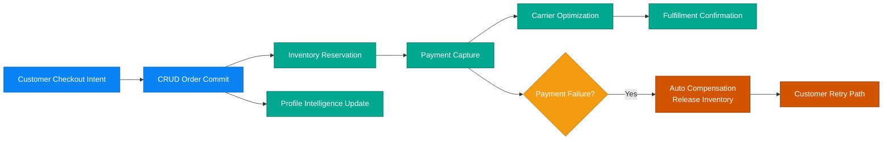

# Business Scenario 01: Order-to-Fulfillment

## Executive Statement

High-throughput commerce pipeline that protects revenue, enforces stock integrity, and delivers near-real-time confirmation under peak demand.

## Capability Mapping

| Capability | Business Leverage |
| --- | --- |
| CRUD transactional core | Trusted order capture and state transitions |
| Inventory reservation validation | Oversell prevention and inventory confidence |
| Carrier selection intelligence | Cost-speed optimization per shipment |
| Profile aggregation | Immediate post-purchase customer intelligence |

## Outcome Targets

| North-Star KPI | Target |
| --- | --- |
| Order-to-confirmation latency | < 5s p95 |
| Reservation integrity | > 99.9% |
| Payment-to-shipment continuity | > 97% |
| Compensation cycle (failure path) | < 2s |

## Executive Flow

