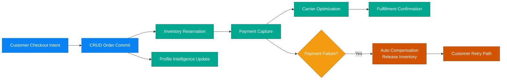

# Business Scenario 01: Order-to-Fulfillment

## Executive Statement

High-throughput commerce pipeline that protects revenue, enforces stock integrity, and delivers near-real-time confirmation under peak demand.

## Capability Mapping

| Capability | Business Leverage |
| --- | --- |
| CRUD transactional core | Trusted order capture and state transitions |
| Inventory reservation validation | Oversell prevention and inventory confidence |
| Carrier selection intelligence | Cost-speed optimization per shipment |
| Profile aggregation | Immediate post-purchase customer intelligence |

## Outcome Targets

| North-Star KPI | Target |
| --- | --- |
| Order-to-confirmation latency | < 5s p95 |
| Reservation integrity | > 99.9% |
| Payment-to-shipment continuity | > 97% |
| Compensation cycle (failure path) | < 2s |

## Executive Flow

## Real Checkout Contract (Issue #210)

Checkout in this scenario runs on the live CRUD payment path (no stubbed success responses).

1. `POST /api/checkout/validate` validates cart and inventory warnings/errors.
2. `POST /api/orders` creates the order record.
3. `POST /api/payments/intent` creates a Stripe PaymentIntent for client-side confirmation.
4. Frontend confirms payment with Stripe.js.
5. `POST /api/payments/confirm-intent` reconciles the confirmed PaymentIntent back to the order, persists payment, sets order status to `paid`, and publishes payment-processed event when transitioning to paid.
6. `GET /api/payments/{payment_id}` supports post-checkout payment retrieval (customer ownership, staff/admin override).

Business impact: confirmation is tied to provider-backed payment state and auditable order/payment linkage, preserving payment-to-shipment continuity targets.
