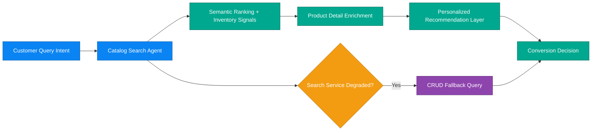

# Business Scenario 02: Product Discovery & Enrichment

## Executive Statement

Conversion acceleration engine that combines semantic discovery, AI enrichment, and resilient fallback to keep revenue flowing during peak traffic.

## Capability Mapping

| Capability | Business Leverage |
| --- | --- |
| Catalog search intelligence | High-relevance results and lower bounce |
| Product detail enrichment | Better content quality and conversion lift |
| Cart intelligence | Incremental AOV through contextual upsell |
| CRUD fallback path | Availability protection when search intelligence degrades |

## Outcome Targets

| North-Star KPI | Target |
| --- | --- |
| Search response latency | < 1.2s p95 |
| Search-to-product click-through | > 35% |
| Enriched catalog coverage | > 98% |
| Fallback continuity during degradation | > 99% |

## Executive Flow

