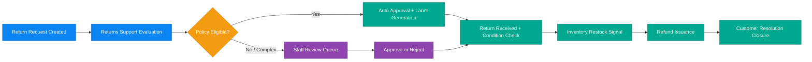

# Business Scenario 03: Returns & Refund Processing

## Executive Statement

Reverse-logistics value stream that protects margins, accelerates customer trust recovery, and minimizes manual exception handling.

## Capability Mapping

| Capability | Business Leverage |
| --- | --- |
| Returns support intelligence | Faster policy evaluation and fewer manual touches |
| Inventory health check | Quicker restock and recovered sellable inventory |
| CRM support context | Better retention outcomes on high-risk returns |
| Event-driven refund progression | Predictable and auditable refund lifecycle |

## Outcome Targets

| North-Star KPI | Target |
| --- | --- |
| Return decision latency | < 10 min for auto-eligible cases |
| Refund cycle time | < 72h for approved returns |
| Restock recovery time | < 24h |
| Manual review rate | < 20% of total returns |

## Executive Flow

## Implemented Lifecycle Scope (Issue #217)

This scenario is implemented through CRUD lifecycle APIs and staff operations (not agent-orchestrated workflow).

### Canonical Return Lifecycle

- `requested -> approved|rejected -> received -> restocked -> refunded`
- Terminal states: `rejected`, `refunded`
- Invalid transitions return `409 Conflict`

### Customer Journey (Implemented APIs)

- `POST /api/returns` creates a return request in `requested`
- `GET /api/returns` lists customer-owned returns
- `GET /api/returns/{return_id}` returns lifecycle timeline and attached refund snapshot when present
- `GET /api/returns/{return_id}/refund` returns refund progression (`issued`)

### Staff Operations (Implemented APIs)

- `GET /api/staff/returns/` and `GET /api/staff/returns/{return_id}` provide shared read model access
- Transition endpoints: `POST /approve`, `POST /reject`, `POST /receive`, `POST /restock`, `POST /refund`
- Legacy compatibility endpoint: `PATCH /api/staff/returns/{return_id}/approve`

### Event Outcomes

- Return lifecycle events are emitted to `return-events`: `ReturnRequested`, `ReturnApproved`, `ReturnRejected`, `ReturnReceived`, `ReturnRestocked`, `ReturnRefunded`
- Refund issuance is emitted to `payment-events` as `RefundIssued`
