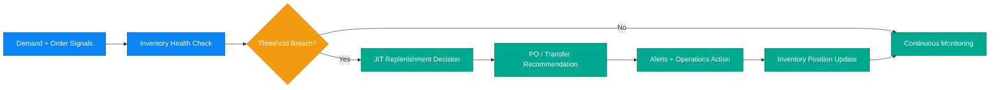

# Business Scenario 04: Inventory Optimization

## Executive Statement

Predictive inventory control loop that balances availability, working capital, and replenishment speed under volatile demand.

## Capability Mapping

| Capability | Business Leverage |
| --- | --- |
| Inventory health monitoring | Early detection of stock integrity risks |
| JIT replenishment intelligence | Smarter reorder quantities and timing |
| Alerts and triggers | Prioritized operational intervention |
| Checkout scarcity integration | Conversion uplift with real-time urgency context |

## Outcome Targets

| North-Star KPI | Target |
| --- | --- |
| Stockout rate on priority SKUs | < 1.5% |
| Replenishment lead-time adherence | > 95% |
| Inventory anomaly detection precision | > 90% |
| Working-capital efficiency uplift | +10% YoY |

## Executive Flow

