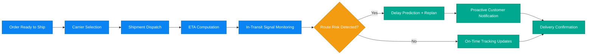

# Business Scenario 05: Shipment & Delivery Tracking

## Executive Statement

Proactive logistics intelligence pipeline that improves ETA confidence, reduces WISMO pressure, and optimizes carrier economics.

## Capability Mapping

| Capability | Business Leverage |
| --- | --- |
| Carrier selection intelligence | Lower cost-to-ship with SLA compliance |
| ETA computation | Accurate expectation setting and trust retention |
| Route issue detection | Early disruption detection and mitigation |
| CRM notification context | Proactive communication and support deflection |

## Outcome Targets

| North-Star KPI | Target |
| --- | --- |
| ETA prediction accuracy | > 92% |
| WISMO ticket reduction | > 60% |
| Late-delivery incident rate | < 5% |
| Carrier cost optimization gain | 8–15% |

## Executive Flow

