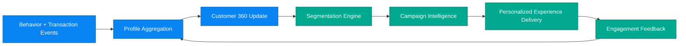

# Business Scenario 06: Customer 360 & Personalization

## Executive Statement

Real-time CRM intelligence mesh that fuses behavioral, transactional, and segment context to maximize LTV and campaign performance.

## Capability Mapping

| Capability | Business Leverage |
| --- | --- |
| Profile aggregation | Unified customer context for every touchpoint |
| Segmentation personalization | Higher relevance and retention outcomes |
| Campaign intelligence | Better offer timing and message fit |
| Warm-memory profile persistence | Durable personalization continuity |

## Outcome Targets

| North-Star KPI | Target |
| --- | --- |
| Personalized conversion uplift | 2–3x vs generic baseline |
| Segment refresh latency | < 5 min |
| Campaign CTR improvement | +30% |
| Churn-risk interception success | > 25% uplift |

## Executive Flow

## UI Personalization Contract Flow (Issue #215)

Brand-shopping personalization in the UI now runs entirely through CRUD-owned contracts under `/api`:

1. `GET /api/catalog/products/{sku}`
2. `GET /api/customers/{customer_id}/profile`
3. `POST /api/pricing/offers`
4. `POST /api/recommendations/rank`
5. `POST /api/recommendations/compose`

Execution model used by the dashboard personalization flow:
- UI fetches product and customer profile first.
- UI requests deterministic offer computation for the selected SKU and quantity.
- UI submits ranked candidates for recommendation scoring.
- UI composes final recommendation cards from ranked items.

Versioning strategy for these contracts:
- Current contract surface is `v1` on `/api` with additive-only changes.
- Breaking schema/path changes must introduce a new versioned path (for example `/api/v2/...`) and run in parallel during migration.

## Dashboard/Profile Contract Alignment (Issue #28)

- Dashboard and profile UI flows now consume supported data paths via API hooks and same-origin `/api/*` contracts.
- Remaining fabricated dashboard/profile values were removed.
- Where no backend contract exists (for example rewards points/progress, saved addresses, payment methods, and related profile tabs), the UI renders explicit unavailable/unsupported states instead of hardcoded placeholders.
- Scope claim is intentionally limited to supported dashboard/profile data paths and explicit no-contract states.
