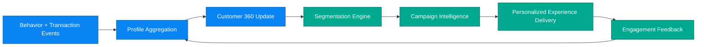

# Business Scenario 06: Customer 360 & Personalization

## Executive Statement

Real-time CRM intelligence mesh that fuses behavioral, transactional, and segment context to maximize LTV and campaign performance.

## Capability Mapping

| Capability | Business Leverage |
| --- | --- |
| Profile aggregation | Unified customer context for every touchpoint |
| Segmentation personalization | Higher relevance and retention outcomes |
| Campaign intelligence | Better offer timing and message fit |
| Warm-memory profile persistence | Durable personalization continuity |

## Outcome Targets

| North-Star KPI | Target |
| --- | --- |
| Personalized conversion uplift | 2–3x vs generic baseline |
| Segment refresh latency | < 5 min |
| Campaign CTR improvement | +30% |
| Churn-risk interception success | > 25% uplift |

## Executive Flow

