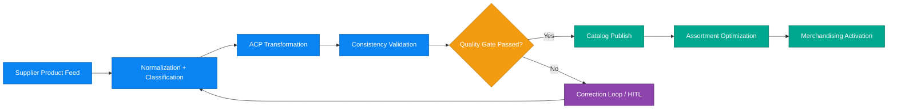

# Business Scenario 07: Product Lifecycle Management

## Executive Statement

Quality-gated product pipeline that standardizes supplier inputs, enforces consistency, and accelerates time-to-shelf for high-impact assortments.

## Capability Mapping

| Capability | Business Leverage |
| --- | --- |
| Normalization and classification | Faster onboarding and taxonomy consistency |
| ACP transformation | Cross-channel product contract reliability |
| Consistency validation | Reduced data defects and returns |
| Assortment optimization | Revenue-per-category and margin lift |

## Outcome Targets

| North-Star KPI | Target |
| --- | --- |
| Product onboarding cycle time | < 30 min |
| Catalog data quality score | > 98% |
| Validation pass-through rate | > 95% |
| Assortment yield uplift | +10% |

## Executive Flow

