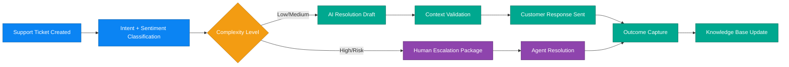

# Business Scenario 08: Customer Support Resolution

## Executive Statement

AI-first support resolution loop that compresses response time, improves first-contact resolution, and escalates only high-complexity cases.

## Capability Mapping

| Capability | Business Leverage |
| --- | --- |
| Support assistance agent | Fast triage and intent-aware response drafts |
| Order and returns context retrieval | Higher-quality resolution accuracy |
| Escalation intelligence | Better human handoff for sensitive/complex tickets |
| Knowledge feedback loop | Continuous deflection and service quality improvement |

## Outcome Targets

| North-Star KPI | Target |
| --- | --- |
| First-contact resolution | 60–80% |
| Initial response latency | < 30s |
| Cost per resolved ticket | -50% vs baseline |
| CSAT trend | > 4.2/5 |

## Executive Flow

