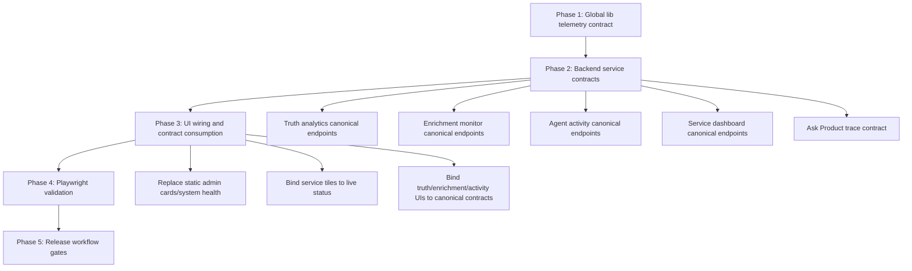

# Live Demo Truth Program — Implementation Backlog

**Date**: 2026-03-24  
**Owner**: Platform/Architecture + Service Leads + UI Lead  
**Status**: Ready for issue creation  
**Scope**: Backlog artifact only (no application code changes in this document)

---

## 1) Program intent and governance alignment

This backlog operationalizes end-to-end live truthful demoability across admin surfaces and agent-assisted search, aligned with:

- `docs/governance/README.md`
- `docs/governance/frontend-governance.md`
- `docs/governance/infrastructure-governance.md`
- `docs/implementation/truth-layer-api.md`

### Delivery constraints

- en-US only.
- Contract-first delivery: API contracts and telemetry schema before broad UI wiring.
- Required sequence:
  1. Global `lib` issues
  2. Per-service backend contracts
  3. UI wiring
  4. Playwright validation
  5. Release/workflow gating

---

## 2) Full UI metric-to-endpoint contract matrix (admin + ask product)

## 2.1 Admin portal summary cards (`/admin`)

| Surface | UI metric/widget | UI source | Current endpoint contract | Upstream service/owner | Current state | Gap |
|---|---|---|---|---|---|---|
| Summary cards | Active Services | `apps/ui/app/admin/page.tsx` | None | N/A | Static hardcoded (`21`) | Must be computed from service registry/health data |
| Summary cards | API Calls (24h) | `apps/ui/app/admin/page.tsx` | None | N/A | Static hardcoded (`1.2M`) | Must come from telemetry aggregate |
| Summary cards | Uptime | `apps/ui/app/admin/page.tsx` | None | N/A | Static hardcoded (`99.9%`) | Must come from service SLO/health aggregate |
| Summary cards | Avg Response | `apps/ui/app/admin/page.tsx` | None | N/A | Static hardcoded (`120ms`) | Must come from latency histogram aggregate |

## 2.2 Admin service tiles (`/admin`)

| Surface | UI tile link | UI source | Contract used | Upstream service | Current state | Gap |
|---|---|---|---|---|---|---|
| Service tiles | CRM/eCommerce/Inventory/Logistics/Product links | `apps/ui/app/admin/page.tsx` | Route navigation only | N/A | Static list and static status badge (`Active`) | Add live status, last update, error indicator |
| Service dashboard page | `/admin/[domain]/[service]` | `apps/ui/components/admin/AdminServiceDashboardPage.tsx` + `apps/ui/lib/services/adminServiceDashboardService.ts` | `GET /api/admin/{domain}/{service}?time_range=<range>` | Currently synthesized in UI proxy (`apps/ui/app/api/[...path]/route.ts`) | Live-ish via proxy aggregation/fallback | Move ownership to canonical backend contracts |

### Tile-to-service map currently encoded in UI proxy

- `crm/campaigns -> crm-campaign-intelligence`
- `crm/profiles -> crm-profile-aggregation`
- `crm/segmentation -> crm-segmentation-personalization`
- `crm/support -> crm-support-assistance`
- `ecommerce/catalog -> ecommerce-catalog-search`
- `ecommerce/cart -> ecommerce-cart-intelligence`
- `ecommerce/checkout -> ecommerce-checkout-support`
- `ecommerce/orders -> ecommerce-order-status`
- `ecommerce/products -> ecommerce-product-detail-enrichment`
- `inventory/health -> inventory-health-check`
- `inventory/alerts -> inventory-alerts-triggers`
- `inventory/replenishment -> inventory-jit-replenishment`
- `inventory/reservation -> inventory-reservation-validation`
- `logistics/carriers -> logistics-carrier-selection`
- `logistics/eta -> logistics-eta-computation`
- `logistics/returns -> logistics-returns-support`
- `logistics/routes -> logistics-route-issue-detection`
- `products/acp -> product-management-acp-transformation`
- `products/assortment -> product-management-assortment-optimization`
- `products/validation -> product-management-consistency-validation`
- `products/normalization -> product-management-normalization-classification`

## 2.3 System health monitor (`/admin`)

| Surface | UI metric | UI source | Current endpoint contract | Upstream service | Current state | Gap |
|---|---|---|---|---|---|---|
| System health | Memory Usage | `apps/ui/app/admin/page.tsx` | None | N/A | Static hardcoded (`68%`) | Must be live metric |
| System health | CPU Load | `apps/ui/app/admin/page.tsx` | None | N/A | Static hardcoded (`42%`) | Must be live metric |
| System health | API Latency | `apps/ui/app/admin/page.tsx` | None | N/A | Static hardcoded (`120ms`) | Must be live p50/p95 |
| System health | Error Rate | `apps/ui/app/admin/page.tsx` | None | N/A | Static hardcoded (`0.02%`) | Must be live rolling error rate |
| System health | Queue Depth | `apps/ui/app/admin/page.tsx` | None | N/A | Static hardcoded (`234`) | Must be live queue backlog |
| System health | Cache Hit Rate | `apps/ui/app/admin/page.tsx` | None | N/A | Static hardcoded (`94%`) | Must be live cache metric |

## 2.4 Agent activity (`/admin/agent-activity` + detail/evaluations)

| Surface | UI metric/widget | UI source | Current endpoint contract | Upstream service/owner | Current state | Gap |
|---|---|---|---|---|---|---|
| Agent activity | Health cards | `apps/ui/app/admin/agent-activity/page.tsx` | `GET /api/admin/agent-activity?time_range=<range>` | UI proxy aggregator over agent traces/metrics | Aggregated + fallback | Canonical backend contract with typed schema/version |
| Agent activity | Trace feed | same | `GET /api/admin/agent-activity?time_range=<range>` | same | Aggregated + fallback | Define stable pagination/filter semantics |
| Agent activity | Model usage table | same | `GET /api/admin/agent-activity?time_range=<range>` | same | Aggregated + fallback | Require complete token/latency fields across services |
| Agent activity | Error/retry log | same | Derived from trace feed | same | Derived client-side | Server-side field for retry lifecycle |
| Trace detail | Trace header/timeline/waterfall/tools/models | `apps/ui/app/admin/agent-activity/[traceId]/page.tsx` | `GET /api/admin/agent-activity/traces/{traceId}?time_range=<range>` | UI proxy aggregator | Aggregated + fallback | Canonical trace-detail contract |
| Evaluations | Overall score/pass rate/runs/trends/comparison | `apps/ui/app/admin/agent-activity/evaluations/page.tsx` | `GET /api/admin/agent-activity/evaluations?time_range=<range>` | UI proxy aggregator | Aggregated + fallback | Canonical eval contract + governance thresholds |

## 2.5 Truth analytics (`/admin/truth-analytics`)

| Surface | UI metric/widget | UI source | Current endpoint contract | Upstream service/owner | Current state | Gap |
|---|---|---|---|---|---|---|
| KPI card | Overall Completeness | `apps/ui/app/admin/truth-analytics/page.tsx` | `GET /api/truth/analytics/summary` | UI proxy composes `crud-service /api/completeness/summary` + `truth-hitl /review/stats` | Derived aggregate | Move to canonical backend endpoint ownership |
| KPI card | Enrichment Jobs | same | `GET /api/truth/analytics/summary` | same | Derived aggregate | Clarify true source of enrichment job count |
| KPI card | HITL Queue Pending + Avg Review Time | same | `GET /api/truth/analytics/summary` | same | Derived aggregate | Add consistent review-time definition |
| KPI card | Exports (ACP/UCP) | same | `GET /api/truth/analytics/summary` | same | Currently default zero in proxy | Implement true export counters |
| Queue breakdown | Approved/Rejected/Sent to HITL | same | `GET /api/truth/analytics/summary` | same | Derived aggregate | Ensure consistent event-time windows |
| Completeness chart | Completeness by category | same | `GET /api/truth/analytics/completeness` | UI proxy currently returns synthesized single-row fallback | Partial/simplified | Implement category-level backend contract |
| Throughput chart | Ingested/Enriched/Approved over time | same | `GET /api/truth/analytics/throughput` | UI proxy currently synthesizes one-point fallback | Partial/simplified | Implement true time-series backend contract |

## 2.6 Enrichment monitor (`/admin/enrichment-monitor` + detail)

| Surface | UI metric/widget | UI source | Current endpoint contract | Upstream service/owner | Current state | Gap |
|---|---|---|---|---|---|---|
| Dashboard | Status cards | `apps/ui/app/admin/enrichment-monitor/page.tsx` | `GET /api/admin/enrichment-monitor` | UI proxy + `truth-hitl` review endpoints | Aggregated + fallback | Canonical backend contract for dashboard payload |
| Dashboard | Active jobs table | same | `GET /api/admin/enrichment-monitor` | same | Aggregated + fallback | Add explicit paging/sorting contract |
| Dashboard | Throughput (`per_minute`, `last_10m`, `failed_last_10m`) | same | `GET /api/admin/enrichment-monitor` | same | Aggregated + fallback | Backed by real stage telemetry not proxy synthesis |
| Dashboard | Error log | same | `GET /api/admin/enrichment-monitor` | same | Often empty/fallback | Real error stream contract |
| Detail page | Entity detail + diffs + evidence + reasoning | `apps/ui/app/admin/enrichment-monitor/[entityId]/page.tsx` | `GET /api/admin/enrichment-monitor/{entityId}` | UI proxy + `truth-hitl` | Partial | Standardize detail schema |
| Decision action | Quick approve/reject | same + `useEnrichmentDecision` | `POST /api/admin/enrichment-monitor/{entityId}/decision` | proxied to review actions | Implemented via proxy logic | Make backend-native decision endpoint + audit fields |

## 2.7 Ask Product (`/search?agentChat=1`, widget + search page)

| Surface | UI metric/widget | UI source | Current endpoint contract | Upstream service/owner | Current state | Gap |
|---|---|---|---|---|---|---|
| Ask Product widget | Intelligent vs keyword result comparison | `apps/ui/components/organisms/ChatWidget.tsx` + `apps/ui/lib/services/semanticSearchService.ts` | `POST /ecommerce-catalog-search/invoke` (agent path), fallback CRUD product search | `ecommerce-catalog-search` + `crud-service` | Works with fallback | Need stable `trace_id`, intent, and fallback reason telemetry contract |
| Search page | Mode/source chips, intent panel, trace deep-link | `apps/ui/app/search/page.tsx` | Same as above, then link to `/admin/agent-activity/{traceId}` when available | same | Works with optional trace | Must enforce trace presence in intelligent mode success path |

---

## 3) Common `lib` telemetry enhancements (global-first)

### Current global assets

- `lib/src/holiday_peak_lib/utils/telemetry.py`
- `lib/src/holiday_peak_lib/utils/correlation.py`
- `lib/src/holiday_peak_lib/app_factory_components/middleware.py`

### Required enhancements

1. **Telemetry envelope standardization**
   - Required dimensions for all service telemetry events: `service`, `domain`, `operation`, `trace_id`, `correlation_id`, `entity_id`, `status`, `latency_ms`, `model_tier`, `error_count`, `timestamp`.
2. **Cross-service correlation hardening**
   - Guarantee incoming/outgoing propagation for `x-correlation-id` and align with trace context.
3. **Foundry tracer event normalization**
   - Ensure model invocation/tool call/decision events produce consistent keys across all services.
4. **Aggregation-ready metrics primitives**
   - Counters/histograms for request volume, latency, error rate, queue depth, approval/reject outcomes.
5. **Contracted telemetry docs**
   - Add a single telemetry contract doc under `docs/implementation` referenced by service teams and UI/BFF.
  - Current contract: `docs/implementation/telemetry-envelope-v1.md`.

---

## 4) Dependency graph and sequencing

%%{init: {'theme':'base', 'themeVariables': {
  'primaryColor':'#FFB3BA',
  'primaryTextColor':'#000',
  'primaryBorderColor':'#FF8B94',
  'lineColor':'#BAE1FF',
  'secondaryColor':'#BAE1FF',
  'tertiaryColor':'#FFFFFF'
}}}%%

### Sequencing table

| Sequence | Layer | Exit criteria |
|---|---|---|
| 1 | Global `lib` | Telemetry schema + correlation propagation merged and documented |
| 2 | Backend services | Canonical endpoints available and contract-tested |
| 3 | UI wiring | Admin surfaces consume canonical endpoints, no static business metrics |
| 4 | Playwright | End-to-end checks cover admin and ask-product truth paths |
| 5 | Release workflow | CI/CD gates enforce contract + e2e before deployment |

---

## 5) Issue templates and checklists (by issue type)

## 5.1 Template — Global lib telemetry issue

**Title format**: `[LIB][Telemetry] <capability>`  
**Default labels**: `area:lib`, `type:backend`, `priority:p0`, `program:live-demo-truth`

### Checklist

- [ ] Define/extend telemetry schema fields and types.
- [ ] Update `telemetry.py` with normalized event/metric emission.
- [ ] Propagate correlation ID consistently (`correlation.py` + middleware + adapters).
- [ ] Add/extend unit tests under `lib/src/tests/`.
- [ ] Update telemetry contract documentation.

## 5.2 Template — Backend service contract issue

**Title format**: `[Backend][Contract] <service or endpoint>`  
**Default labels**: `type:backend`, `area:api`, `priority:p0|p1`, `program:live-demo-truth`

### Checklist

- [ ] Define request/response schema (versioned).
- [ ] Implement endpoint in owning service (not UI proxy synthesis).
- [ ] Emit required telemetry dimensions.
- [ ] Add unit + integration tests for success/error/fallback semantics.
- [ ] Document endpoint in `docs/implementation`.

## 5.3 Template — UI wiring issue

**Title format**: `[UI][Contract] <screen/widget> wiring`  
**Default labels**: `type:frontend`, `area:ui`, `priority:p1`, `program:live-demo-truth`

### Checklist

- [ ] Replace static metric values with API-bound state.
- [ ] Handle loading/error/stale states explicitly.
- [ ] Preserve route/RBAC behavior.
- [ ] Add/update unit tests for rendered metrics and fallback messaging.
- [ ] Ensure trace links are present when contract returns trace IDs.

## 5.4 Template — Playwright validation issue

**Title format**: `[QA][Playwright] <flow>`  
**Default labels**: `type:test`, `area:ui`, `priority:p1`, `program:live-demo-truth`

### Checklist

- [ ] Add deterministic e2e coverage for target flow.
- [ ] Validate admin route accessibility and core data rendering.
- [ ] Validate ask-product flow with intelligent/keyword comparison UI.
- [ ] Capture trace/evidence assertions when available.
- [ ] Keep tests CI-stable (timeouts/retries only where justified).

## 5.5 Template — Release workflow issue

**Title format**: `[CI/CD][Gate] <policy>`  
**Default labels**: `type:devops`, `area:workflow`, `priority:p1`, `program:live-demo-truth`

### Checklist

- [ ] Add/adjust workflow job(s) for contract and e2e gates.
- [ ] Ensure failure is blocking for required checks.
- [ ] Publish artifacts (test reports/screenshots/traces) for triage.
- [ ] Align with environment policy (`dev`/`prod` rules).
- [ ] Document gate intent and rollback path.

---

## 6) Recommended issue backlog (implementation-ready)

## Phase 1 — Global lib first

### 1. `[LIB][Telemetry] Standardize cross-service telemetry envelope v1`
- **Labels**: `area:lib`, `type:backend`, `priority:p0`, `program:live-demo-truth`
- **Scope**:
  - `lib/src/holiday_peak_lib/utils/telemetry.py`
  - `lib/src/holiday_peak_lib/utils/correlation.py`
  - `lib/src/holiday_peak_lib/app_factory_components/middleware.py`
- **Acceptance criteria**:
  - All emitted events include mandatory dimensions (`service`, `operation`, `trace_id`, `correlation_id`, `status`, `latency_ms`, `timestamp`).
  - Correlation ID is present in inbound and outbound paths.
  - Unit tests validate schema and propagation.

### 2. `[LIB][Telemetry] Normalize Foundry trace event contracts (tool/model/decision)`
- **Labels**: `area:lib`, `type:backend`, `priority:p0`, `program:live-demo-truth`
- **Scope**:
  - `lib/src/holiday_peak_lib/utils/telemetry.py`
  - `lib/src/holiday_peak_lib/agents/base_agent.py`
  - `lib/src/holiday_peak_lib/agents/foundry.py`
- **Acceptance criteria**:
  - Tool, model, and decision traces use consistent keys and status enums.
  - `Agent Activity` backend aggregators can parse all supported services without per-service special casing.

### 3. `[LIB][Docs] Publish telemetry contract for admin truth dashboards`
- **Labels**: `area:lib`, `type:docs`, `priority:p1`, `program:live-demo-truth`
- **Scope**:
  - New/updated doc under `docs/implementation/` (telemetry contract)
  - Reference from `docs/implementation/live-demo-truth-program.md`
- **Acceptance criteria**:
  - Contract doc defines required fields, units, enums, and examples.
  - Service onboarding checklist included.

## Phase 2 — Per-service backend contracts

### 4. `[Backend][Contract] CRUD owns canonical truth analytics endpoints`
- **Labels**: `type:backend`, `area:api`, `priority:p0`, `program:live-demo-truth`
- **Scope**:
  - `apps/crud-service/src/crud_service/routes/completeness.py`
  - `apps/crud-service/src/crud_service/main.py` (router wiring)
  - `apps/crud-service/tests/` (unit + integration)
- **Acceptance criteria**:
  - Canonical `GET /api/truth/analytics/summary|completeness|throughput` contracts are implemented server-side.
  - Data is category/time-window aware (not single synthetic row).
  - Exports counters (`acp_exports`, `ucp_exports`) are populated from authoritative source.

### 5. `[Backend][Contract] Truth HITL review stats/queue/detail contract hardening`
- **Labels**: `type:backend`, `area:truth`, `priority:p0`, `program:live-demo-truth`
- **Scope**:
  - `apps/truth-hitl/src/truth_hitl/routes.py`
  - `apps/truth-hitl/src/truth_hitl/review_manager.py`
  - `apps/truth-hitl/tests/`
- **Acceptance criteria**:
  - Queue/stats/detail endpoints expose stable typed fields needed by enrichment monitor and truth analytics.
  - Pagination, filters, and decision audit metadata are explicit and tested.

### 6. `[Backend][Contract] Canonical enrichment monitor API (dashboard + detail + decision)`
- **Labels**: `type:backend`, `area:truth`, `priority:p0`, `program:live-demo-truth`
- **Scope**:
  - Owning service(s): `apps/truth-hitl`, `apps/truth-enrichment` (as selected in design)
  - API proxy handoff contract updates in `apps/ui/app/api/[...path]/route.ts` (consumer compatibility only)
- **Acceptance criteria**:
  - `GET /api/admin/enrichment-monitor` and `GET/POST /api/admin/enrichment-monitor/{entityId}[/decision]` map to canonical backend APIs.
  - Payload includes throughput, error log, and stable detail schema.

### 7. `[Backend][Contract] Canonical agent activity API (dashboard, traces, evaluations)`
- **Labels**: `type:backend`, `area:observability`, `priority:p0`, `program:live-demo-truth`
- **Scope**:
  - Agent services from `DEFAULT_AGENT_ACTIVITY_SERVICES` in `apps/ui/app/api/[...path]/route.ts`
  - Shared instrumentation via `lib/src/holiday_peak_lib/utils/telemetry.py`
- **Acceptance criteria**:
  - `GET /api/admin/agent-activity`, `/health`, `/evaluations`, `/traces/{traceId}` contracts are backend-owned.
  - Every listed service emits parsable metrics/traces with required dimensions.

### 8. `[Backend][Contract] Admin service dashboard contract moved out of UI synthesis`
- **Labels**: `type:backend`, `area:admin`, `priority:p1`, `program:live-demo-truth`
- **Scope**:
  - Domain services mapped in `ADMIN_SERVICE_AGENT_MAP`
  - Contract serving endpoint for `GET /api/admin/{domain}/{service}`
- **Acceptance criteria**:
  - Dashboard status/activity/model usage payload is served by canonical backend owner.
  - UI proxy only forwards, without metric synthesis.

### 9. `[Backend][Contract] Ask Product trace + intent + fallback reason guarantees`
- **Labels**: `type:backend`, `area:search`, `priority:p1`, `program:live-demo-truth`
- **Scope**:
  - `apps/ecommerce-catalog-search/src/**`
  - `apps/search-enrichment-agent/src/**`
- **Acceptance criteria**:
  - Intelligent search success path returns stable `trace_id`, `intent`, and mode metadata.
  - Fallback reason contract is explicit for unavailable/mock scenarios.

## Phase 3 — UI wiring after backend contracts

### 10. `[UI][Contract] Replace static admin summary cards and system health with live contracts`
- **Labels**: `type:frontend`, `area:ui`, `priority:p1`, `program:live-demo-truth`
- **Scope**:
  - `apps/ui/app/admin/page.tsx`
  - `apps/ui/lib/services/*` + `apps/ui/lib/hooks/*` (new admin summary/system health clients)
- **Acceptance criteria**:
  - No hardcoded business metrics in `/admin` summary/system health sections.
  - Loading/error states implemented and tested.

### 11. `[UI][Contract] Service tiles show live status and last update`
- **Labels**: `type:frontend`, `area:ui`, `priority:p1`, `program:live-demo-truth`
- **Scope**:
  - `apps/ui/app/admin/page.tsx`
  - `apps/ui/components/admin/AdminServiceDashboardPage.tsx`
- **Acceptance criteria**:
  - Tile badges reflect live status from contract, not static “Active”.
  - Status/state aligns with corresponding service dashboard endpoint.

### 12. `[UI][Contract] Truth analytics page consumes canonical backend endpoints`
- **Labels**: `type:frontend`, `area:ui`, `priority:p1`, `program:live-demo-truth`
- **Scope**:
  - `apps/ui/app/admin/truth-analytics/page.tsx`
  - `apps/ui/lib/services/truthAdminService.ts`
- **Acceptance criteria**:
  - KPIs/charts render from canonical backend responses.
  - Export counters and category/time-series charts reflect real data.

### 13. `[UI][Contract] Enrichment monitor and detail pages bind canonical contracts`
- **Labels**: `type:frontend`, `area:ui`, `priority:p1`, `program:live-demo-truth`
- **Scope**:
  - `apps/ui/app/admin/enrichment-monitor/page.tsx`
  - `apps/ui/app/admin/enrichment-monitor/[entityId]/page.tsx`
  - `apps/ui/lib/services/enrichmentMonitorService.ts`
- **Acceptance criteria**:
  - Dashboard/detail data and decision actions use canonical contracts.
  - Error log and throughput fields are displayed from backend source.

### 14. `[UI][Contract] Agent activity (dashboard, trace detail, evaluations) strict contract wiring`
- **Labels**: `type:frontend`, `area:ui`, `priority:p1`, `program:live-demo-truth`
- **Scope**:
  - `apps/ui/app/admin/agent-activity/page.tsx`
  - `apps/ui/app/admin/agent-activity/[traceId]/page.tsx`
  - `apps/ui/app/admin/agent-activity/evaluations/page.tsx`
  - `apps/ui/lib/services/agentMonitorService.ts`
- **Acceptance criteria**:
  - Pages render only canonical contract fields (no hidden synthesis assumptions).
  - Trace detail links from search/enrichment remain valid.

### 15. `[UI][Contract] Ask Product widget + search page contract parity`
- **Labels**: `type:frontend`, `area:ui`, `priority:p1`, `program:live-demo-truth`
- **Scope**:
  - `apps/ui/components/organisms/ChatWidget.tsx`
  - `apps/ui/app/search/page.tsx`
  - `apps/ui/lib/services/semanticSearchService.ts`
- **Acceptance criteria**:
  - Intelligent-vs-keyword comparison uses stable contract mapping.
  - Trace deep-link is shown whenever intelligent search returns trace metadata.

## Phase 4 — Playwright validation

### 16. `[QA][Playwright] Add admin truth flows e2e coverage`
- **Labels**: `type:test`, `area:ui`, `priority:p1`, `program:live-demo-truth`
- **Scope**:
  - `apps/ui/tests/e2e/critical-flows.spec.ts` (extend)
  - Additional spec files under `apps/ui/tests/e2e/`
- **Acceptance criteria**:
  - Coverage includes `/admin`, `/admin/truth-analytics`, `/admin/enrichment-monitor`, `/admin/agent-activity`.
  - Validates load/error contract states and at least one trace link path.

### 17. `[QA][Playwright] Add Ask Product comparison and trace-link e2e`
- **Labels**: `type:test`, `area:ui`, `priority:p1`, `program:live-demo-truth`
- **Scope**:
  - `apps/ui/tests/e2e/` (new spec for `/search?agentChat=1`)
- **Acceptance criteria**:
  - Verifies intelligent vs keyword comparison rendering.
  - Verifies trace navigation to Agent Activity when trace ID is returned.

## Phase 5 — Release workflow and gates

### 18. `[CI/CD][Gate] Add Playwright live-demo-truth gate to CI`
- **Labels**: `type:devops`, `area:workflow`, `priority:p1`, `program:live-demo-truth`
- **Scope**:
  - `.github/workflows/ui-contract-gate.yml`
  - `.github/workflows/ci.yml`
- **Acceptance criteria**:
  - Playwright truth/admin suite runs in CI and is configured as required check for `main`.
  - Artifacts (trace/screenshots/video) are uploaded for failed runs.

### 19. `[CI/CD][Gate] Deployment smoke checks include admin truth surfaces`
- **Labels**: `type:devops`, `area:workflow`, `priority:p1`, `program:live-demo-truth`
- **Scope**:
  - `.github/workflows/deploy-ui-swa.yml`
  - `.github/workflows/deploy-azd.yml`
- **Acceptance criteria**:
  - Post-deploy smoke includes truth/admin endpoint checks (truth analytics, enrichment monitor, agent activity) beyond generic health/products/categories.
  - Failures are hard-stop for gated environments.

---

## 7) Execution notes for issue creation

- Create issues in order of phase (1→5); do not start UI wiring before Phase 2 contracts are merged.
- Use a single parent tracking issue labeled `program:live-demo-truth` and link all child issues.
- Add dependency links between issues using the sequence in Section 4.
- Keep implementation PRs minimal and scoped to each issue’s file/service list.
