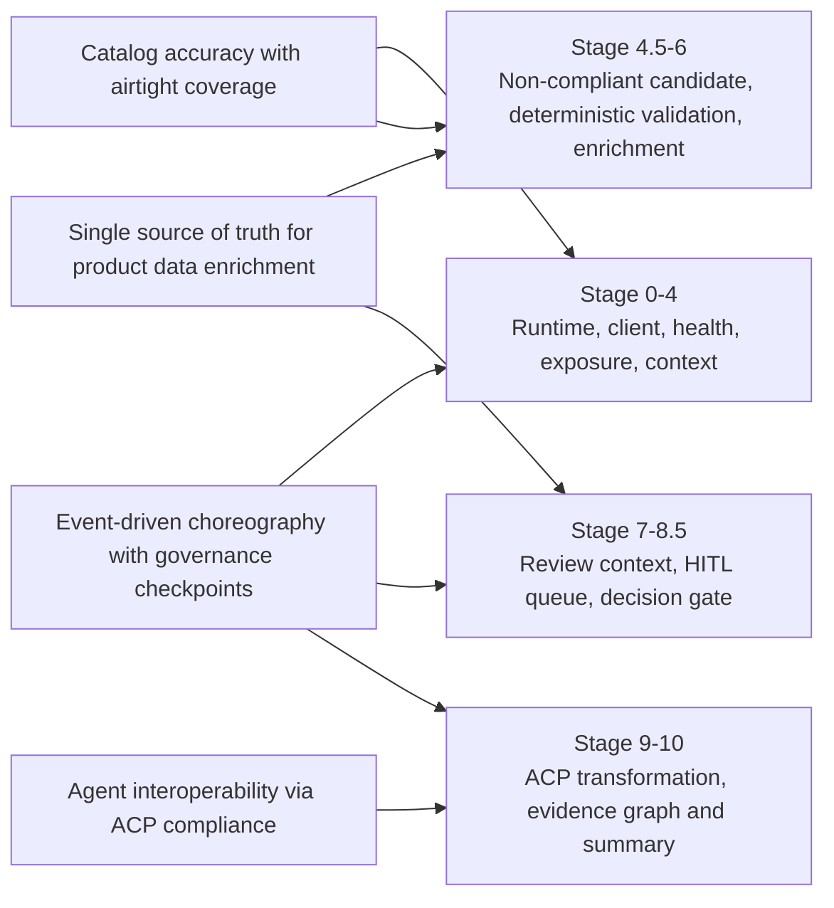

# Truth Layer API Reference

This document describes currently available truth-layer endpoints and planned service contracts for the ingestion → completeness → enrichment → review → export workflow.

It also documents the grounded showcase flow used by `samples/notebooks/product-truth-layer-end-to-end-demo.ipynb`, aligned to the agentic architecture patterns in `docs/architecture/architecture.md`.

## Grounded Notebook Stage Map

The notebook executes a live APIM-backed flow using these stage labels:

1. `Stage 0 - Runtime Contract`
2. `Stage 1 - Strict HTTP Client`
3. `Stage 2 - Health Gate`
4. `Stage 3 - Gateway Exposure Matrix`
5. `Stage 4 - Select Product and Category Context`
6. `Stage 4.5 - Build Mock Non-Compliant Candidate`
7. `Stage 5 - Deterministic Consistency Validation`
8. `Stage 6 - Product Detail Enrichment Agent`
9. `Stage 7 - Review Context from CRUD`
10. `Stage 8 - HITL Queue Observation`
11. `Stage 8.5 - HITL Validation Decision (Approve/Reject/Edit)`
12. `Stage 9 - ACP Transformation`
13. `Stage 10 - Product Evidence Graph and Summary`

Business purpose: the flow demonstrates deterministic quality controls (validation + HITL governance) composed with agentic enrichment and transformation over live service boundaries.

## Overall Business-to-Execution Flow



## Each Step Execution

```mermaid
flowchart TB
  subgraph X[Execution Lane]
    S0[Stage 0\nRuntime Contract]
    S1[Stage 1\nStrict HTTP Client]
    S2[Stage 2\nHealth Gate]
    S3[Stage 3\nGateway Exposure Matrix]
    S4[Stage 4\nSelect Product and Category Context]
    S45[Stage 4.5\nBuild Mock Non-Compliant Candidate]
    S5[Stage 5\nDeterministic Consistency Validation]
    S6[Stage 6\nProduct Detail Enrichment Agent]
    S7[Stage 7\nReview Context from CRUD]
    S8[Stage 8\nHITL Queue Observation]
    S85{Stage 8.5\nHITL Validation Decision}
    D1[approve]
    D2[reject]
    D3[edit_and_approve]
    D4[observe_only]
    S9[Stage 9\nACP Transformation]
    S10[Stage 10\nProduct Evidence Graph and Summary]

    S0 --> S1 --> S2 --> S3 --> S4 --> S45 --> S5 --> S6 --> S7 --> S8 --> S85
    S85 --> D1 --> S9
    S85 --> D3 --> S9
    S85 --> D2 --> S10
    S85 --> D4 --> S10
    S9 --> S10
  end

  subgraph Y[Evidence Lane]
    ET[Event Timeline Capture\n(event_id, event_type, timestamp,\ncorrelation_id, causation_id,\nstage, actor, decision, quality)]
  end

  S0 -.-> ET
  S2 -.-> ET
  S5 -.-> ET
  S8 -.-> ET
  S85 -.-> ET
  S9 -.-> ET
  S10 -.-> ET
```

## Stage Objective and Signal Map

| Stage | Business objective | Measurable signal |
| --- | --- | --- |
| `0` | Enforce safe runtime boundaries before live calls | Contract flags loaded (`STRICT_REMOTE_ONLY`, mutation guard state) |
| `1` | Ensure stable execution under strict HTTP behavior | Client retries/timeouts policy active |
| `2` | Gate on service health before business operations | Health/readiness pass rate (`2xx`) |
| `3` | Confirm required API surfaces are reachable | Gateway exposure matrix coverage by route |
| `4` | Select valid product/category context for governance flow | Selected SKU + category resolved |
| `4.5` | Inject controlled non-compliance for repeatable governance checks | Synthetic violation count by rule type |
| `5` | Detect deterministic quality gaps before agentic actions | `completeness_score`, gap count, enrichable gap count |
| `6` | Propose richer product detail context | Enrichment fields proposed/applied count |
| `7` | Ground review decisions in transactional context | CRUD review context retrieval success |
| `8` | Observe pending HITL workload and queue state | Pending attribute IDs and queue stats |
| `8.5` | Apply human governance decision (`approve/reject/edit_and_approve/observe_only`) | Decision outcome distribution by type |
| `9` | Produce ACP-aligned export payload for interoperability | ACP transformation success + payload completeness |
| `10` | Preserve auditable end-to-end execution evidence | Timeline event count and stage coverage |

## Scope and Current Status

- Implemented services in the current repo/deployment topology:
  - `truth-ingestion` (custom REST ingestion routes + standard service endpoints)
  - `product-management-consistency-validation` (single-path schema-driven completeness engine)
  - `ecommerce-product-detail-enrichment` (enrichment via `/invoke`)
  - `product-management-acp-transformation` (ACP export via `/invoke`)
  - `crud-service` (transactional APIs, including review endpoints used as interim review flow)
- Deployment behavior: `truth-ingestion` is included in the same `deploy-azd` agent service matrix path as other agent services.
- Planned but not yet delivered as standalone services in this repository:
  - dedicated Truth HITL service
  - dedicated Truth Export service for protocol variants beyond ACP

## Authentication

- `crud-service` endpoints under `/api/auth`, `/api/users`, `/api/reviews` may require bearer auth depending on route and user role.
- Agent services (`truth-ingestion`, `...-enrichment`, `...-consistency-validation`, `...-acp-transformation`) typically expose:
  - `GET /health`
  - `GET /ready`
  - `POST /invoke`
  - optional `/mcp/*` endpoints registered per service
- For APIM deployments, service routes are exposed using:
  - `/agents/<service-name>/health`
  - `/agents/<service-name>/invoke`
  - `/agents/<service-name>/mcp/{tool}`

## Common Error Model

- `400`: invalid request payload
- `401` / `403`: missing or insufficient auth
- `404`: resource not found
- `422`: validation error
- `500`: internal service error
- `503`: readiness/foundry precondition not satisfied

## Rate Limiting

- Ingestion path uses connector-level throttling for upstream PIM calls (`GenericRestPIMConnector` token bucket + retry/backoff for `429`/`5xx`).
- API gateway-level throttling can be applied in APIM; this repo does not hardcode per-route rate limiting in FastAPI routers.

## Endpoint Reference

## 1) Truth Ingestion Service

Base URL: `http://<truth-ingestion-host>`

| Method | Path | Description |
| --- | --- | --- |
| GET | `/health` | Liveness |
| GET | `/ready` | Readiness |
| GET | `/integrations` | Registered integration health summary |
| POST | `/invoke` | Agent invocation (`action`: `ingest_single`, `ingest_bulk`, `get_status`) |
| POST | `/ingest/product` | Ingest one product payload |
| POST | `/ingest/bulk` | Bulk ingest payload list |
| POST | `/ingest/sync` | Async full sync job trigger |
| GET | `/ingest/status/{job_id}` | Job status lookup |
| POST | `/ingest/webhook` | PIM webhook ingestion |

### Example request: `POST /ingest/product`

```json
{
  "product": {
    "id": "prd-001",
    "sku": "prd-001",
    "title": "Trail Running Shoes",
    "brand": "PeakSport",
    "category_id": "footwear",
    "description": "Lightweight trail shoe"
  }
}
```

## 2) Completeness (Consistency Validation)

Base URL: `http://<consistency-host>`

| Method | Path | Description |
| --- | --- | --- |
| GET | `/health` | Liveness |
| GET | `/ready` | Readiness |
| POST | `/invoke` | Schema-driven completeness evaluation for a SKU |

### Event-driven completeness flow (implemented)

- **Consumes**: Event Hub topic `completeness-jobs` (consumer group: `completeness-engine`)
- **Loads**: product + category schema
- **Evaluates**: weighted completeness score and field-level gaps
- **Stores**: gap report via completeness storage adapter (Cosmos-backed with local/test fallback)
- **Publishes**: `enrichment_requested` to `enrichment-jobs` when:
  - completeness score `< COMPLETENESS_THRESHOLD` (default `0.7`)
  - enrichable gaps are present

### Completeness report model highlights

- `entity_id`, `category_id`, `schema_version`
- `completeness_score` (`0.0`–`1.0`)
- `gaps[]` with gap type (`missing` / `invalid`)
- `enrichable_gaps[]`

### Example request: `POST /invoke` (completeness)

```json
{
  "sku": "prd-001"
}
```

## 3) Enrichment Service

Base URL: `http://<enrichment-host>`

| Method | Path | Description |
| --- | --- | --- |
| GET | `/health` | Liveness |
| GET | `/ready` | Readiness |
| POST | `/invoke` | Enrich product detail context by SKU |

### Example request: `POST /invoke` (enrichment)

```json
{
  "sku": "prd-001",
  "related_limit": 4
}
```

## 4) Review / HITL

- Dedicated Truth HITL service is available in this repository and provides review queue APIs.

Base URL: `http://<truth-hitl-host>`

| Method | Path | Description |
| --- | --- | --- |
| GET | `/review/queue` | List pending review items (filter + pagination) |
| GET | `/review/stats` | Queue status counts |
| GET | `/review/{entity_id}` | Pending proposals for one entity |
| POST | `/review/{entity_id}/approve` | Approve one or more pending proposals |
| POST | `/review/{entity_id}/reject` | Reject one or more pending proposals |
| POST | `/review/{entity_id}/edit` | Edit proposed value, then approve |
| POST | `/review/approve/batch` | Batch approve across multiple entities |
| POST | `/review/reject/batch` | Batch reject across multiple entities |

### MCP tools (Truth HITL)

| Tool | Description |
| --- | --- |
| `/hitl/queue` | List pending queue items |
| `/hitl/stats` | Return queue stats |
| `/hitl/audit` | Return audit trail entries |
| `/review/get_proposal` | Return proposal detail for an entity (optional `attr_id`) |

### Review proposal payload extensions

When available, proposal payloads include enrichment context fields for reviewer decisioning:

- `original_data`
- `enriched_data`
- `reasoning`
- `source_assets`
- `source_type`

These fields are optional for backward compatibility with older proposals.

For enhanced review UI support, `reasoning` and `source_assets` accept richer shapes:

- `reasoning`: string, list of strings, or structured reasoning objects.
- `source_assets`: list containing DAM image URLs and/or structured asset metadata objects.

### Example MCP response: `/review/get_proposal`

```json
{
  "entity_id": "prod-100",
  "proposal": {
    "entity_id": "prod-100",
    "attr_id": "attr-200",
    "field_name": "material",
    "proposed_value": "Organic Cotton",
    "current_value": null,
    "original_data": {
      "material": null
    },
    "enriched_data": {
      "material": "Organic Cotton"
    },
    "reasoning": [
      "Image texture suggests cotton",
      "Catalog title includes 'cotton'"
    ],
    "source_assets": [
      "https://cdn.example.com/products/prod-100/front.jpg",
      {
        "asset_id": "dam-200",
        "url": "https://cdn.example.com/products/prod-100/zoom.jpg",
        "kind": "image"
      }
    ],
    "source_type": "hybrid"
  }
}
```

### HITL Decision Gate in the Notebook

- Queue observation occurs in `Stage 8 - HITL Queue Observation` using Truth HITL `stats` and `list` actions.
- Decisioning occurs in `Stage 8.5 - HITL Validation Decision (Approve/Reject/Edit)`.
- Decision outcomes are: `approve`, `reject`, `edit_and_approve`, `observe_only`.
- Default behavior is safe: if there are no pending attribute IDs, the decision is `observe_only` and no mutation attempt is made.
- Review execution is conditional and only attempted when:
  - a review-target attribute exists, and
  - demo mutation mode is explicitly enabled.

## 5) Export Service

Base URL: `http://<truth-export-host>`

| Method | Path | Description |
| --- | --- | --- |
| GET | `/health` | Liveness |
| GET | `/ready` | Readiness |
| POST | `/export/ucp/{entity_id}` | Export approved entity payload as UCP |
| POST | `/export/acp/{entity_id}` | Export approved entity payload as ACP |
| POST | `/export/pim/{entity_id}` | Trigger PIM writeback for one approved entity |
| POST | `/export/pim/batch` | Trigger bounded-concurrency PIM writeback for up to 100 entities |
| GET | `/export/protocols` | List supported export protocols |

### Example request: `POST /export/pim/prod-001` (single writeback)

```json
{
  "dry_run": false,
  "approved_fields": ["title", "description"],
  "trigger": "api"
}
```

### HITL approval event trigger

When a reviewer approves or edits-and-approves in `truth-hitl`, the service publishes an
`export-jobs` message (`event_type=hitl.approved`) to trigger `truth-export` writeback.

Event payload (`data`) includes:

- `entity_id`
- `approved_fields`
- `reviewer_id`
- `decision_timestamp`
- `protocol` (`pim`)
- `status` (`approved`)

## 6) CRUD Endpoints Used in Truth Workflows

Base URL: `http://<crud-host>`

| Method | Path | Purpose |
| --- | --- | --- |
| GET | `/health` | CRUD service liveness |
| GET | `/ready` | CRUD readiness |
| GET | `/api/products` | Product retrieval for validation/export |
| GET | `/api/products/{product_id}` | Product detail |
| GET | `/api/categories` | Category metadata |
| GET | `/api/orders` | Operational workflow context |

## Example End-to-End Workflow

1. Ingest product:
   - `POST /ingest/product`
2. Run completeness validation:
   - `POST <consistency>/invoke` with SKU
3. Enrich product details:
   - `POST <enrichment>/invoke` with SKU
4. Review workflow:
  - Approve via `truth-hitl` `/review/{entity_id}/approve` (or batch approve)
5. Export:
  - `truth-hitl` emits `export-jobs` approval event
  - `truth-export` consumes event and runs PIM writeback via `/export/pim/*` flow

## Governance Demonstration: Intentional Non-Compliant Candidate

`Stage 4.5 - Build Mock Non-Compliant Candidate` intentionally injects deterministic violations (for example missing brand, invalid price, weak naming, and malformed attribute types).

Why this is intentional:

- Validates that policy and quality controls detect known bad input.
- Demonstrates business governance behavior without requiring production data corruption.
- Creates a repeatable test vector for HITL decision logic and operational reviews.

This supports architecture goals for explicit governance checkpoints across deterministic and agentic steps.

## Event Metadata Timeline and Observability

The notebook emits per-stage events into an in-notebook timeline used for operational evidence.

### Event metadata schema (core fields)

- `event_id`: unique event identifier.
- `event_type`: stage transition/event category.
- `timestamp`: UTC event timestamp.
- `correlation_id`: flow-wide trace key.
- `causation_id`: parent event pointer.
- `entity_id`: product/entity under processing.
- `stage`: stage identifier (for example `stage_8_5_hitl_decision`).
- `actor`: service or component responsible.
- `decision`: outcome at this step.
- `reason`: short human-readable rationale.
- `quality`: structured metrics (counts/confidence/status values).

Operational value:

- Provides end-to-end traceability across validation, enrichment, HITL, and transformation.
- Improves incident triage by preserving decision rationale next to service outcomes.
- Produces demo evidence that maps directly to live APIM call boundaries.

## Demo Safety Controls and Mutation Guardrails

The showcase is safe-by-default and designed to prevent accidental live mutations:

- `DEMO_MUTATION_MODE` defaults to `false`.
- `STRICT_REMOTE_ONLY` enforces live APIM/AKS boundaries and blocks local fallback execution.
- Sandbox metadata tags (`tenant_id=demo-notebook`, `environment=sandbox`, `is_demo=true`) are attached to mutation-shaped payloads.
- HITL review writes are skipped unless explicit mutation mode is enabled and a valid review target exists.

Together these controls preserve production integrity while still demonstrating full governance flow and decision outcomes.

## Sample Automation Scripts

- [samples/scripts/ingest_sample.py](../../samples/scripts/ingest_sample.py)
- [samples/scripts/bulk_ingest.py](../../samples/scripts/bulk_ingest.py)
- [samples/scripts/review_workflow.py](../../samples/scripts/review_workflow.py)
- [samples/scripts/export_demo.py](../../samples/scripts/export_demo.py)

## Postman Collection

- [samples/postman/truth-layer.postman_collection.json](../../samples/postman/truth-layer.postman_collection.json)
