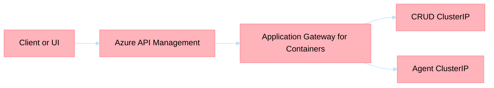

# 013: AGC Edge Migration Plan

**Severity**: High  
**Category**: Infrastructure  
**Discovered**: March 2026

## Summary

The repository and live environment currently straddle historical AGIC/classic Application Gateway assumptions, AKS Web App Routing defaults, and APIM sync logic that still resolves ingress targets dynamically. The recommended corrective direction is to standardize on:

- `APIM -> AGC -> AKS`
- APIM as the only supported public API facade
- AGC as the only supported AKS ingress layer
- AKS backends remaining `ClusterIP`

ADR-027 is the accepted target-state decision for this migration. ADR-026 remains historical context only where its implementation details differ.

This roadmap tracks the migration from the current broken nginx/public ingress path to AGC.

## Target State

## Non-Goals

- Full private north-south ingress in the first migration wave
- Simultaneous redesign of APIM public contracts
- Bundling Gateway API modernization with the first ingress cutover

## Work Breakdown

| Step | Work Item | Outcome |
|---|---|---|
| 1 | Architecture decision and governance update | AGC becomes the documented standard edge for AKS |
| 2 | AGC IaC enablement in shared infrastructure | Dev environment can provision and expose AGC |
| 3 | Kubernetes ingress abstraction update | Helm/manifests can publish to AGC without public service exposure |
| 4 | APIM sync refactor | APIM targets AGC hostnames, not live cluster IPs |
| 5 | Workflow and smoke gate refactor | CI/CD validates AGC readiness before APIM/UI rollout |
| 6 | CRUD cutover and soak | First production-critical workload moves to AGC |
| 7 | Legacy ingress retirement | Web App Routing/nginx and legacy assumptions are removed |

## Proposed GitHub Issues

| Order | Scope | Purpose | GitHub Issue |
|---|---|---|---|
| 1 | Architecture and governance | Record the edge decision and replace AGIC/nginx-first policy text | [#282](https://github.com/Azure-Samples/holiday-peak-hub/issues/282) |
| 2 | AGC shared-infra enablement | Add AGC subnet, delegation, identity, and controller wiring | [#283](https://github.com/Azure-Samples/holiday-peak-hub/issues/283) |
| 3 | AGC routing resources in Helm/manifests | Publish CRUD and agent routes to AGC while keeping backends `ClusterIP` | [#284](https://github.com/Azure-Samples/holiday-peak-hub/issues/284) |
| 4 | APIM hostname-based AGC backend sync | Stop targeting raw ingress IPs and align APIM to AGC hostnames | [#285](https://github.com/Azure-Samples/holiday-peak-hub/issues/285) |
| 5 | CI/CD validation and cutover gates | Make workflow validation AGC-aware and fail-fast on drift | [#286](https://github.com/Azure-Samples/holiday-peak-hub/issues/286) |
| 6 | CRUD cutover, soak, and legacy ingress retirement | Move live traffic and remove obsolete ingress defaults | [#287](https://github.com/Azure-Samples/holiday-peak-hub/issues/287) |

## Acceptance Criteria by Phase

### Phase 1: Design and Infra

- New ADR accepted for APIM + AGC edge
- Governance documents explicitly define AGC as the canonical ingress target state
- Governance documents explicitly forbid APIM backends that target pod IPs, node IPs, `ClusterIP` addresses, or `*.svc.cluster.local` names
- Shared infra can provision AGC prerequisites in dev

### Phase 2: Kubernetes and APIM Contract

- CRUD and at least one agent can be published through AGC
- All migrated services remain `ClusterIP`
- APIM sync resolves a stable AGC hostname instead of pod, node, or service IPs

### Phase 3: Validation and Cutover

- Workflow validates AGC readiness before APIM sync
- Required smoke tests pass for direct AGC and APIM-mediated CRUD paths
- Rollback from AGC back to the previous APIM backend target is documented and tested in dev

### Phase 4: Retirement

- Legacy Web App Routing defaults are removed from render hooks and workflow detection
- Legacy ingress remediation steps are removed from operator runbooks
- One full deployment cycle completes without dependence on the old ingress path

## Risks

1. AGC frontend remains public, so this is not a full private-edge solution.
2. Host-header mismatches between APIM and AGC can cause false-negative health results.
3. Leaving both ingress stacks active for too long increases configuration drift.
4. Mixing APIM path rewrites with AGC rewrites can recreate the current failure mode.

## References

- [ADR-027](../architecture/adrs/adr-027-apim-agc-edge.md)
- [ADR-026](../architecture/adrs/adr-026-agic-traffic-management.md)
- [Infrastructure Governance](../governance/infrastructure-governance.md)
- [Deployment Guide](../../.infra/DEPLOYMENT.md)